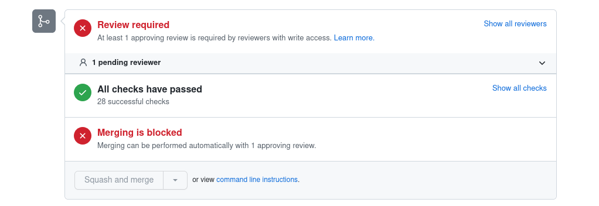
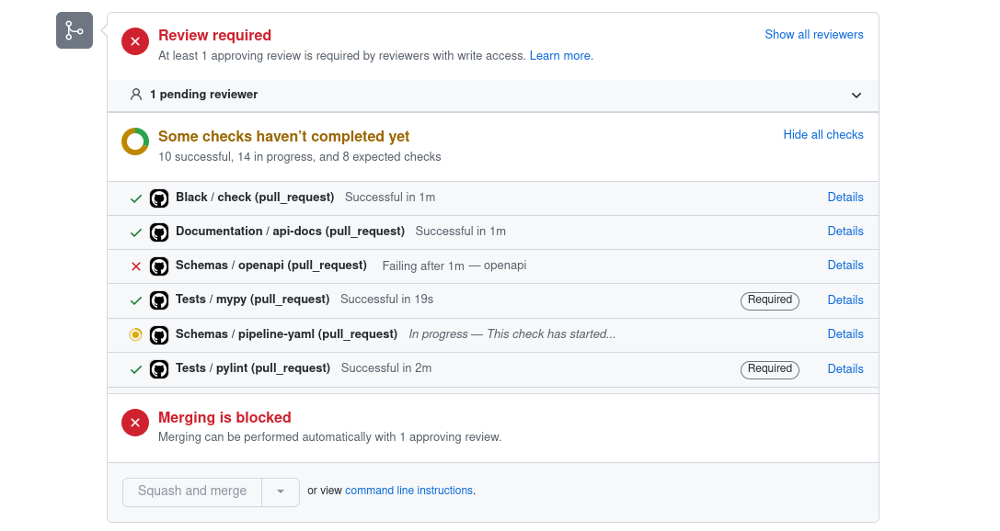
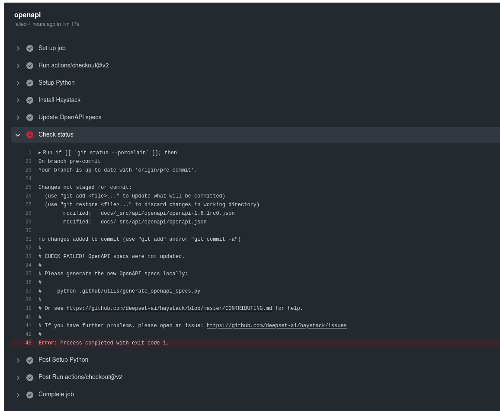
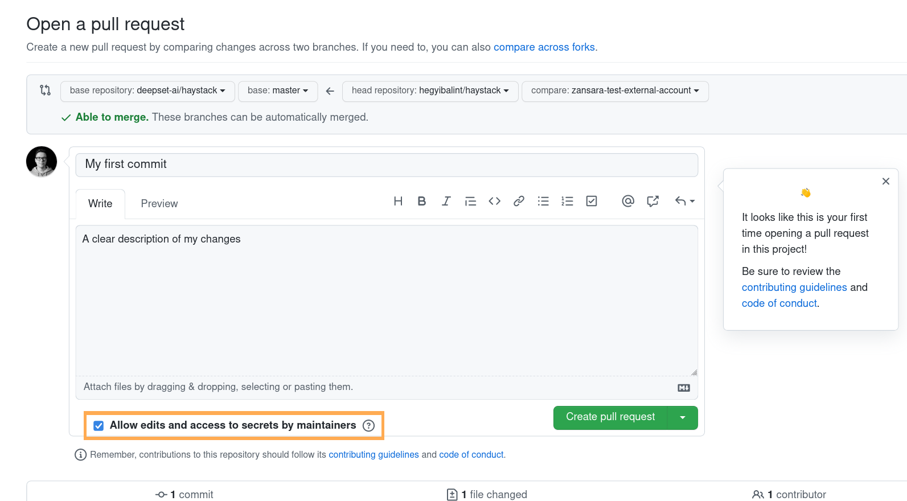

# Contributing to Haystack

We are very open to community contributions and appreciate anything that improves `haystack`! This includes fixings typos, adding missing documentation, fixing bugs or adding new features.
To avoid unnecessary work on either side, please stick to the following process:

1. Check if there is already [a related issue](https://github.com/deepset-ai/haystack/issues).
2. If not, open a new issue to start a quick discussion. Some features might be a nice idea, but don't fit in the scope of Haystack and we hate to close finished PRs!
3. Once you're ready to start, setup you development environment (see below).
4. Once you have commits to publish, create a draft pull request with the initial sketch of the implementation and ask for feedback. **Do not wait until the feature is complete!** If this is your first pull request and you wonder how to actually create a pull request, checkout [this manual](https://opensource.com/article/19/7/create-pull-request-github).
5. Verify that all tests in the CI pass (and add new ones if you implement anything new).


## Setting up your development environment

Even though Haystack runs on Linux, MacOS and Windows, we current we mostly support development on Linux and MacOS. Windows contributors might encounter issues. To work around these, consider using [WSL](https://docs.microsoft.com/en-us/windows/wsl/about) for contributing to Haystack.

The following instructions are **tested on Linux (Ubuntu).**

### Prerequisites

Before starting, make sure your system packages are up-to-date and that a few dependencies are installed. From the terminal, run:

```bash
sudo apt update && sudo apt-get install libsndfile1 ffmpeg
```

You might need to install additional dependencies, depending on what exactly you will be working with. Refer to the relevant node's documentation to understand which dependencies are required.

### Installation

Now fork and clone the repo. From the terminal, run:

```bash
git clone https://github.com/<your-gh-username>/haystack.git
```

or use your favourite Git(Hub) client.

Then move into the cloned folder, create a virtualenv, and perform an **editable install**.

```bash
# Move into the cloned folder
cd haystack/

# Create a virtual environment
python3 -m venv venv

# Activate the environment
source venv/bin/activate

# Upgrade pip (very important!)
pip install --upgrade pip

# Install Haystack in editable mode
pip install -e '.[dev]'
```
Note that the `.[dev]` part is enough in many development scenarios when adding minor code fixes. However, if your changes require a schema change, then you'll need to install all dependencies with `pip install -e '.[all,dev]' ` command. Introducing new components or changing their interface requires a schema change.
This will install all the dependencies you need to work on the codebase, plus testing and formatting dependencies.

Last, install the pre-commit hooks with:

```bash
pre-commit install
```

This utility will run some tasks right before all `git commit` operations. From now on, your `git commit` output for Haystack should look something like this:

```
> git commit -m "test"
check python ast.....................................(no files to check)Skipped
check json...........................................(no files to check)Skipped
check yaml...............................................................Passed
check toml...........................................(no files to check)Skipped
fix end of files.........................................................Passed
trim trailing whitespace.................................................Passed
check for merge conflicts................................................Passed
check that scripts with shebangs are executable..........................Passed
mixed line ending........................................................Passed
don't commit to branch...................................................Passed
pretty format json...................................(no files to check)Skipped
black................................................(no files to check)Skipped
Update API documentation (slow)..........................................Passed
[my-branch bc7f4af7] test
 1 files changed, 1 insertions(+), 0 deletions(-)
```

Note: If you prefer you can run this hook before `git push` instead of `git commit`. To do so, install the hook with `pre-commit install --hook-type pre-push`

Note: pre-commit hooks might fail. If that happens to you and you can't understand why, please do the following:
- Ask for help by opening an issue or reaching out on our Discord channel. We usually give some feedback within a day for most questions.
- As the last resort, if you are desperate and everything failed, ask Git to skip the hook with `git commit --no-verify`. This command will suspend all pre-commit hooks and let you push in all cases. The CI might fail, but at that point we will be able to help.
- In case of further issues pushing your changes, please uninstall the hook with `pre-commit uninstall -t pre-commit -t pre-push` and review your Git setup.

## Proposing "Substantial" Changes

Most of the changes to Haystack, including bug fixes and small improvements, are implemented through the normal Pull Request workflow, according to these  contribution guidelines.

Some changes, though, are "substantial", and these are the ones we want to put through a bit of a design process to make sure we're all on the same page before we invest the time into the actual implementation of a new feature or a deep refactoring.

Please check the [Proposals design process](/proposals) if you think your contribution may include the following:

- A new feature that creates new API surface areas.
- A new component (Nodes, Pipelines, Document Stores).
- Removing features that already shipped in the current minor version.
- A deep refactoring that would require new tests or introduce new dependencies.
- A change that's complex enough to require multiple steps to be delivered.

## Requirements for Pull Requests

To ease the review process, please follow the instructions in this paragraph when creating a Pull Request.

### PR Title
We use elements from the [conventional commit convention](https://www.conventionalcommits.org/en/v1.0.0/) for our
PR titles. Your PR title should follow the same structure of commit type, scope, and description as the convention
specifies:

```
<type>[optional scope]: <description>
```

Common types are:
- `feat` (for enhancements)
- `bug` (for bug fixes)
- `docs` (for changes to the documentation)
- `test` (for changes to the tests)
- `perf` (for performance improvements)
- `refactor` (for code refactorings)

If your change is breaking backwards compatibility (e.g. introducing a new required parameter) use a `!` after the type
to indicate that your PR contains breaking changes.

Examples:
- `feat: add pinecone document store`
- `bug: fix MultiLabel serialization`
- `feat!: make all document store methods async`

### PR Description
Please use the existing [pull request template](https://github.com/deepset-ai/haystack/blob/main/.github/pull_request_template.md)
for describing and documenting your changes:

- Link the issue that this relates to
- What is changing?
- What are limitations?
- Breaking changes (Example of before vs. after)
- How did you test the change?

### Release notes
Each PR should include a file under the `releasenotes/notes` path created with `reno`, unless the PR doesn't have any
impact on Haystack behavior, for example: tests and documentation updates, changes in code comments or docstrings,
changes to the CI/CD systems. PRs that don't require a release note file must be labeled with `ignore-for-release-notes`
by a maintainer in order to bypass the CI check.

Say your PR is for bumping the `transformers` version in the `pyproject.toml` file. To create the corresponding release
note, from the root of the repo run:
```
$ reno new bump-transformers-to-4-31
loaded configuration file ./releasenotes/config.yaml
Created new notes file in releasenotes/notes/bump-transformers-to-4-31-a645334d57eab673.yaml
```
`reno` will create the file appending a unique id to the name of the release note you provided (in this case,
`bump-transformers-to-4-31`). You don't need to worry about duplicated entries, but be sure to use meaningful names
so it's easier to find the file later. You can now edit the file to add the release note. In the file, you will find multiple
sections along with an explanation of what they're for. Normally, you only need to fill one section; in this case, you
would fill the `enhancements` section to describe the change:
```yaml
enhancements:
  - |
    Upgrade transformers to the latest version 4.31.0 so that Haystack can support the new LLama2 models.
```
You can now add the file to the git repo and commit your changes. Your release note will be reviewed along with the
code you changed.

## CI (Continuous Integration)

We use GitHub Action for our Continuous Integration tasks. This means that, as soon as you open a PR, GitHub will start executing some workflows on your code, like automated tests, linting, formatting, api docs generation, etc.

If all goes well, at the bottom of your PR page you should see something like this, where all checks are green.



If you see some red checks (like the following), then something didn't work, and action is needed from your side.



Click on the failing test and see if there are instructions at the end of the logs of the failed test.
For example, in the case above, the CI will give you instructions on how to fix the issue.



## Working from Github forks

In order for maintainers to be able to help you, we usually ask contributors to give us push access to their fork.

To do so, please verify that "Allow edits and access to secrets by maintainers" on the PR preview page is checked (you can check it later on the PR's sidebar once it's created).




## Running the tests

Tests will automatically run in our CI for every commit you push to your PR on Github. This is usually the most convenient
way and we encourage you to create early "draft pull requests" to leverage the CI at an early stage.

Tests can also be executed locally, by launching `pytest` from the `/test` folder (this is important because running from the
root folder would also execute the rest API tests, that require specific dependencies).

You can control which tests to run using Pytest markers, let's see how.

### Running a subset of tests (recommended)
In most cases you rather want to run a **subset of tests** locally that are related to your dev, and the most important
option to reduce the number of tests in a meaningful way, is to run tests only for a list of **selected document stores**.
This is possible by adding the `--document_store_type` arg to your `pytest` command (possible values are: `"elasticsearch, faiss, memory, weaviate, pinecone"`).

For example, calling `pytest . --document_store_type="memory"` will run all the document store tests using the
InMemoryDocumentStore only, skipping the others (the logs will show which ones). The `InMemoryDocument` store is a very
good starting point as it doesn't require any external resource:
```
pytest . --document_store_type="memory"
```

You can also run the tests using a **combination of document stores**, provided the corresponding services are up and
running in your local environment. For example, Elasticsearch must be running before launching the following:
```
pytest . --document_store_type="memory,elasticsearch"
```

**Note:** we recommend using Docker containers to run document stores locally:
```
# Elasticsearch
docker run -d -p 9200:9200 -e "discovery.type=single-node" -e "ES_JAVA_OPTS=-Xms128m -Xmx256m" elasticsearch:7.9.2

# Weaviate
docker run -d -p 8080:8080 --name haystack_test_weaviate --env AUTHENTICATION_ANONYMOUS_ACCESS_ENABLED='true' --env PERSISTENCE_DATA_PATH='/var/lib/weaviate' --env ENABLE_EXPERIMENTAL_BM25='true' semitechnologies/weaviate:1.14.1

# Tika
docker run -d -p 9998:9998 -e "TIKA_CHILD_JAVA_OPTS=-JXms128m" -e "TIKA_CHILD_JAVA_OPTS=-JXmx128m" apache/tika:1.28.4
```

Tests can be also run **individually**:
```
pytest -v test_retriever.py::test_dpr_embedding
```

Or you can select a **logical subset of tests** via markers and the optional "not" keyword:
```
pytest -m not elasticsearch
pytest -m elasticsearch
pytest -m generator
pytest -m tika
pytest -m not slow
...
```

### Running all the tests
**Important**: If you want to run **all** the tests locally, you'll need **all** document stores running in the background
before you run the tests. Many of the tests will then be executed multiple times with different document stores.

To run all tests, from the `/test` folder just run:
```
pytest
```

## Writing tests

We formally define three scopes for tests in Haystack with different requirements and purposes:

### Unit test
- Tests a single logical concept
- Execution time is a few milliseconds
- Any external resource is mocked
- Always returns the same result
- Can run in any order
- Runs at every commit in draft and ready PRs, automated through pytest
- Can run locally with no additional setup
- **Goal: being confident in merging code**

### Integration test
- Tests a single logical concept
- Execution time is a few seconds
- It uses external resources that must be available before execution
- When using models, cannot use inference
- Always returns the same result or an error
- Can run in any order
- Runs at every commit in ready PRs, automated through pytest
- Can run locally with some additional setup (e.g. Docker)
- **Goal: being confident in merging code**

### End to End (e2e) test
- Tests a sequence of multiple logical concepts
- Execution time has no limits (can be always on)
- Can use inference
- Evaluates the results of the execution or the status of the system
- It uses external resources that must be available before execution
- Can return different results
- Can be dependent on the order
- Can be wrapped into any process execution
- Runs outside the development cycle (nightly or on demand)
- Might not be possible to run locally due to system and hardware requirements
- **Goal: being confident in releasing Haystack**

> **Note**: migrating the existing tests into these new categories is still in progress. Please ask the maintainers if you are in doubt about how to
classify your tests or where to place them.

If you are writing a test that depend on a document store, there are a few conventions to define on which document store
type this test should/can run:

### Option 1: The test should run on all document stores / those supplied in the CLI arg `--document_store_type`:
Use one of the fixtures `document_store` or `document_store_with_docs` or `document_store_type`.
Do not parameterize it yourself.

Example:
```
def test_write_with_duplicate_doc_ids(document_store):
        ...
        document_store.write(docs)
        ....

```

### Option 2: The test is only compatible with certain document stores:
Some tests you don't want to run on all possible document stores. Either because the test is specific to one/few doc store(s) or the test is not really document store related and it's enough to test it on one document store and speed up the execution time.

Example:
```
# Currently update_document_meta() is not implemented for InMemoryDocStore so it's not listed here as an option

@pytest.mark.parametrize("document_store", ["elasticsearch", "faiss"], indirect=True)
def test_update_meta(document_store):
    ....
```

### Option 3: The test is not using a `document_store`/ fixture, but still has a hard requirement for a certain document store:
Example:
```
@pytest.mark.elasticsearch
def test_elasticsearch_custom_fields(elasticsearch_fixture):
    client = Elasticsearch()
    client.indices.delete(index='haystack_test_custom', ignore=[404])
    document_store = ElasticsearchDocumentStore(index="haystack_test_custom", text_field="custom_text_field",
                                                embedding_field="custom_embedding_field")
```

## Code format and style

We use [Black](https://github.com/psf/black) to ensure consistent code style, [mypy](http://mypy-lang.org/) for static type checking and
[pylint](https://pylint.org/) for linting and code quality.

All checks and autoformatting happen on the CI, so in general you don't need to worry about configuring them in your local environment.
However, should you prefer to execute them locally, here are a few details about the setup.

### Black
Black runs with no other configuration than increasing line length to 120 characters. Its configuration can be found in `pyproject.toml`.

You can run it with `python -m black .` from the root folder.

### Mypy
Mypy currently runs with limited configuration options that can be found at the bottom of `pyproject.toml`.

You can run it with `python -m mypy haystack/ rest_api/` from the root folder.

### Pylint
Pylint is still being integrated in Haystack. The current exclusion list is very long, and can be found in `pyproject.toml`.

You can run it with `python -m pylint haystack/ rest_api/ -ry` from the root folder.


## Contributor Licence Agreement (CLA)

Significant contributions to Haystack require a Contributor License Agreement (CLA). If the contribution requires a CLA, we will get in contact with you. CLAs are quite common among company backed open-source frameworks and our CLA’s wording is similar to other popular projects, like [Rasa](https://cla-assistant.io/RasaHQ/rasa) or [Google's Tensorflow](https://cla.developers.google.com/clas/new?domain=DOMAIN_GOOGLE&kind=KIND_INDIVIDUAL) (retrieved 4th November 2021).

The agreement's main purpose is to protect the continued open use of Haystack. At the same time it also helps in protecting you as a contributor. Contributions under this agreement will ensure that your code will continue to be open to everyone in the future (“You hereby grant to Deepset **and anyone** [...]”) as well as removing liabilities on your end (“you provide your Contributions on an AS IS basis, without warranties or conditions of any kind [...]”). You can find the Contributor Licence Agreement [here](https://cla-assistant.io/deepset-ai/haystack).

If you have further questions about the licensing feel free to reach out to contributors@deepset.ai.
