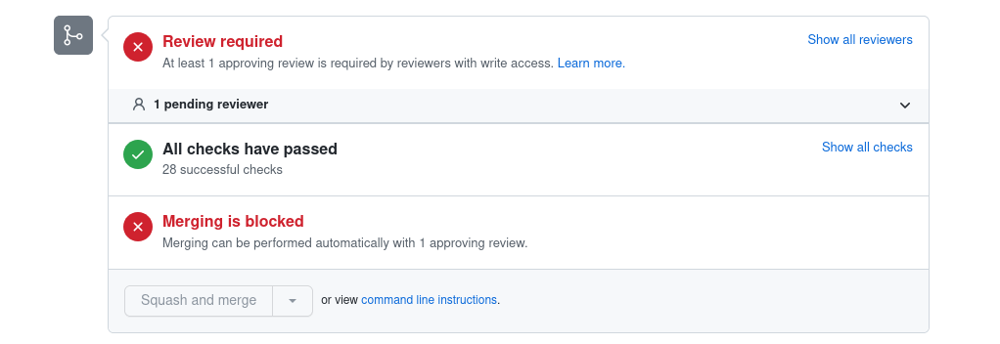
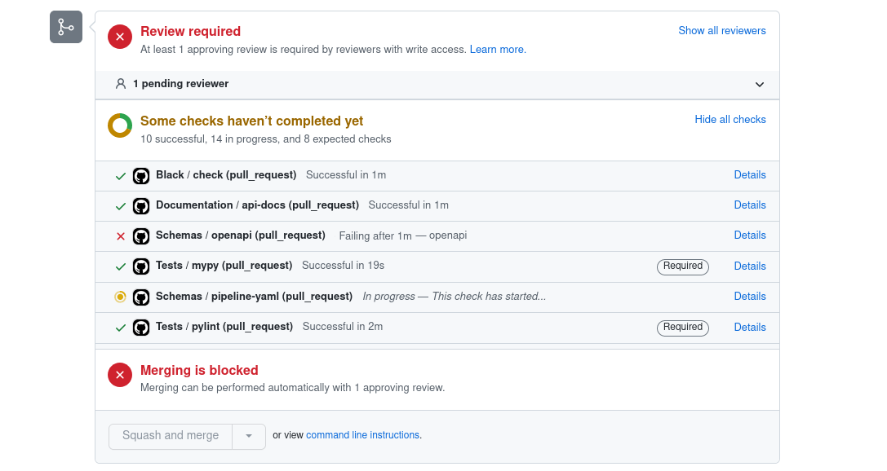
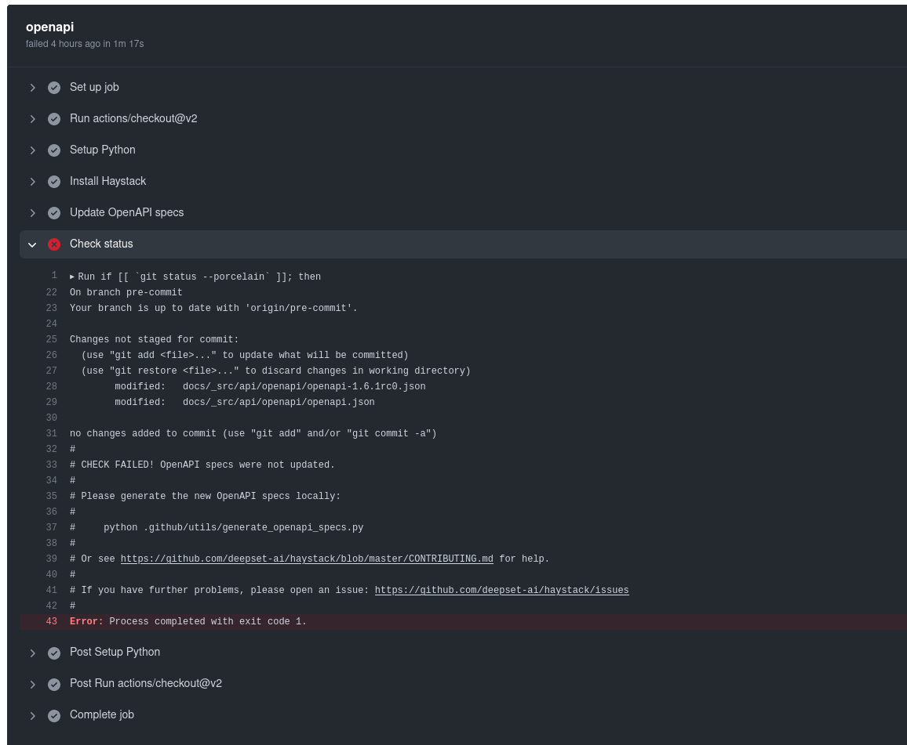
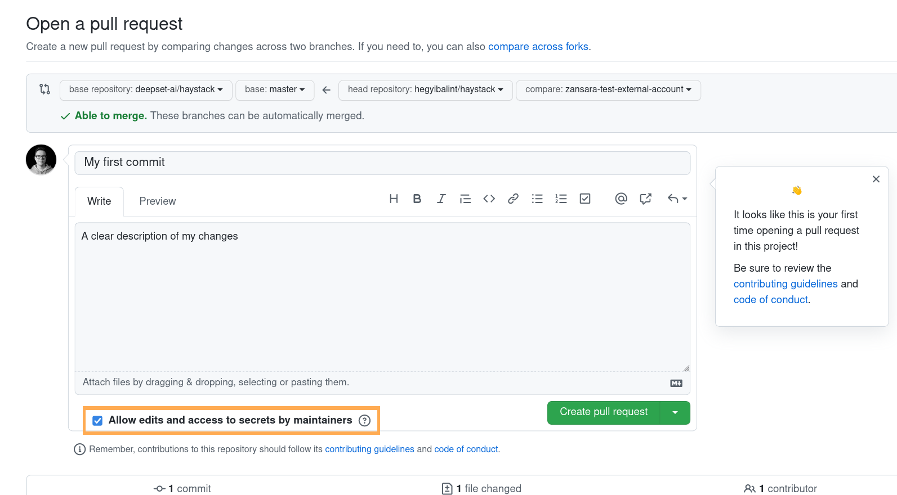

# Contributing to Haystack

First off, thanks for taking the time to contribute! :blue_heart:

All types of contributions are encouraged and valued. See the [Table of Contents](#table-of-contents)
for different ways to help and details about how this project handles them. Please make sure to read
the relevant section before making your contribution. It will make it a lot easier for us maintainers
and smooth out the experience for all involved. The community looks forward to your contributions!

> [!TIP]
> If you like Haystack but just don't have time to contribute, that's fine. There are other easy ways to support the
> project and show your appreciation: star this repository ⭐, mention Haystack at local meetups and tell your
> friends/colleagues, or share what you build and tag [Haystack on X (Twitter)](https://x.com/Haystack_ai) and
> [Haystack on LinkedIn](https://www.linkedin.com/showcase/haystack-ai-framework) — we'd love to see it!

## Your first PR — high-level to-do list

Use this checklist to stay on track for your first code PR:

- **Pick an issue** — Choose one labeled [good first issue](https://github.com/deepset-ai/haystack/issues?q=is%3Aopen+is%3Aissue+label%3A%22good+first+issue%22) or [contributions wanted](https://github.com/deepset-ai/haystack/issues?q=is%3Aissue%20state%3Aopen%20label%3A"Contributions%20wanted!"). Avoid issues marked or commented as [handled internally](#issues-not-open-for-external-contributions).
- **Fork and clone** — [Clone the repository](#clone-the-git-repository), run `pre-commit install`, and create a branch.
- **Set up and run** — [Set up your development environment](#setting-up-your-development-environment), run unit tests with `hatch run test:unit` and run quality checks with `hatch run test:types` and `hatch run fmt`.
- **Implement and test** — Make your changes, add or update tests as needed, and ensure tests and pre-commit checks pass locally.
- **Documentation** — If your change adds or alters user-facing behavior, add a new docs page or update the relevant one in `docs-website/` (edit under `docs/` for the next release; add new pages to `sidebars.js`). See the [Documentation Contributing Guide](docs-website/CONTRIBUTING.md) for where to edit, frontmatter, and navigation.
- **Release notes** — Add a release note under `releasenotes/notes` with `hatch run release-note your-change-name` (see [Release notes](#release-notes)); maintainers can add `ignore-for-release-notes` for tests-only or CI-only changes.
- **Open the PR** — Use a [conventional commit](https://www.conventionalcommits.org/en/v1.0.0/) title, fill the [PR template](.github/pull_request_template.md), and if the PR was fully AI-generated, add a [short disclaimer](#using-ai-assistants-to-contribute). Enable "Allow edits and access to secrets by maintainers" on the PR.
- **Sign the CLA** — A [Contributor Licence Agreement (CLA)](https://cla-assistant.io/deepset-ai/haystack) is required for all contributions. Sign when prompted so your PR is ready for review (see [CLA](#contributor-licence-agreement-cla)).
- **Once the PR is open** — Fix any [CI](#ci-continuous-integration) failures and address review feedback.

**Table of Contents**

- [Contributing to Haystack](#contributing-to-haystack)
  - [Your first PR — high-level to-do list](#your-first-pr--high-level-to-do-list)
  - [Code of Conduct](#code-of-conduct)
  - [I Have a Question](#i-have-a-question)
  - [Reporting Bugs](#reporting-bugs)
    - [Before Submitting a Bug Report](#before-submitting-a-bug-report)
    - [How Do I Submit a Good Bug Report?](#how-do-i-submit-a-good-bug-report)
  - [Suggesting Enhancements](#suggesting-enhancements)
    - [Before Submitting an Enhancement](#before-submitting-an-enhancement)
    - [How Do I Submit a Good Enhancement Suggestion?](#how-do-i-submit-a-good-enhancement-suggestion)
  - [Contributing to Documentation](#contributing-to-documentation)
  - [Contribute code](#contribute-code)
    - [Where to start](#where-to-start)
    - [Issues not open for external contributions](#issues-not-open-for-external-contributions)
    - [Example high-quality contributions](#example-high-quality-contributions)
    - [Using AI assistants to contribute](#using-ai-assistants-to-contribute)
    - [Setting up your development environment](#setting-up-your-development-environment)
    - [Clone the git repository](#clone-the-git-repository)
    - [Run the tests locally](#run-the-tests-locally)
  - [Requirements for Pull Requests](#requirements-for-pull-requests)
    - [Release notes](#release-notes)
  - [CI (Continuous Integration)](#ci-continuous-integration)
  - [Working from GitHub forks](#working-from-github-forks)
  - [Writing tests](#writing-tests)
    - [Unit test](#unit-test)
    - [Integration test](#integration-test)
    - [End to End (e2e) test](#end-to-end-e2e-test)
    - [Slow/unstable integration tests (for maintainers)](#slowunstable-integration-tests-for-maintainers)
  - [Contributor Licence Agreement (CLA)](#contributor-licence-agreement-cla)

## Code of Conduct

This project and everyone participating in it is governed by our [Code of Conduct](code_of_conduct.txt).
By participating, you are expected to uphold this code. Please report unacceptable behavior to haystack@deepset.ai.

## I Have a Question

Before you ask a question, it is best to search for existing [Issues](https://github.com/deepset-ai/haystack/issues) that might help you. In case you have
found a suitable issue and still need clarification, you can write your question in this issue. It is also advisable to
search the internet for answers first.

If you then still feel the need to ask a question and need clarification, you can use [Haystack's Discord Server](https://discord.com/invite/xYvH6drSmA).

## Reporting Bugs

### Before Submitting a Bug Report

A good bug report shouldn't leave others needing to chase you up for more information. Therefore, we ask you to
investigate carefully, collect information, and describe the issue in detail in your report. Please complete the
following steps in advance to help us fix any potential bugs as fast as possible.

- Make sure that you are using the latest version.
- Determine if your bug is really a bug and not an error on your side, for example, using incompatible versions.
  Make sure that you have read the [documentation](https://docs.haystack.deepset.ai/docs/intro). If you are looking
  for support, you might want to check [this section](#i-have-a-question).
- To see if other users have experienced (and potentially already solved) the same issue you are having, check if there
  is not already a bug report existing for your bug or error in the [bug tracker](https://github.com/deepset-ai/haystack/issues).
- Also make sure to search the internet (including Stack Overflow) to see if users outside of the GitHub community have
  discussed the issue.
- Collect information about the bug:
  - OS, Platform and Version (Windows, Linux, macOS, x86, ARM)
  - Version of Haystack and the integrations you're using
  - Possibly your input and the output
  - If you can reliably reproduce the issue, a snippet of code we can use

### How Do I Submit a Good Bug Report?

> [!IMPORTANT]
> You must never report security-related issues, vulnerabilities, or bugs, including sensitive information, to the issue tracker, or elsewhere in public. Instead, sensitive bugs must be reported using [this link](https://github.com/deepset-ai/haystack/security/advisories/new).

We use GitHub issues to track bugs and errors. If you run into an issue with the project:

- Open an [Issue of type Bug Report](https://github.com/deepset-ai/haystack/issues/new?assignees=&labels=bug&projects=&template=bug_report.md&title=).
- Explain the behavior you would expect and the actual behavior.
- Please provide as much context as possible and describe the *reproduction steps* that someone else can follow to
  recreate the issue on their own. This usually includes your code. For good bug reports, you should isolate the problem
  and create a reduced test case.
- Provide the information you collected in the previous section.

Once it's filed:

- The project team will label the issue accordingly.
- A team member will try to reproduce the issue with your provided steps. If there are no reproduction steps or no
  obvious way to reproduce the issue, the team will ask you for those steps.
- If the team is able to reproduce it, the issue will be scheduled for a fix or left to be
  [picked up by a community contributor](https://github.com/deepset-ai/haystack/issues?q=is%3Aissue%20state%3Aopen%20label%3A"Contributions%20wanted!").

## Suggesting Enhancements

This section guides you through submitting an enhancement suggestion, including new integrations and improvements
to existing ones. Following these guidelines will help maintainers and the community to understand your suggestion and
find related suggestions.

### Before Submitting an Enhancement

- Make sure that you are using the latest version.
- Read the [documentation](https://docs.haystack.deepset.ai/docs/intro) carefully and find out if the functionality
  is already covered, possibly via particular configuration parameters.
- Perform a [search](https://github.com/deepset-ai/haystack/issues) to see if the enhancement has already been suggested. If it has, add a comment to the
  existing issue instead of opening a new one.
- Find out whether your idea fits with the scope and aims of the project. It's up to you to make a strong case to
  convince the project's developers of the merits of this feature. Keep in mind that we want features that will be
  useful to the majority of our users and not just a small subset. If you're just targeting a minority of users,
  consider writing and distributing the integration on your own.

### How Do I Submit a Good Enhancement Suggestion?

Enhancement suggestions are tracked as GitHub issues of type [Feature request](https://github.com/deepset-ai/haystack/issues/new?template=feature_request.md).

- Use a **clear and descriptive title** for the issue to identify the suggestion.
- Fill in the issue following the template

## Contributing to Documentation

If you'd like to improve the documentation by fixing errors, clarifying explanations, adding examples, or creating new guides, see the [Documentation Contributing Guide](docs-website/CONTRIBUTING.md).

## Contribute code

> [!IMPORTANT]
> When contributing to this project, you must agree that you have authored or carefully reviewed 100% of the content, that you have the necessary rights to the content and that the content you contribute may be provided under the project license.

### Where to start

If this is your first code contribution, a good starting point is looking for an open issue that's marked with the label
["good first issue"](https://github.com/deepset-ai/haystack/issues?q=is%3Aopen+is%3Aissue+label%3A%22good+first+issue%22).
The core contributors periodically mark certain issues as good for first-time contributors. Those issues are usually
limited in scope, easily fixable and low priority, so there is absolutely no reason why you should not try fixing them.
It's a good excuse to start looking into the project and a safe space to experiment and fail: if you don't get the
grasp of something, pick another one! Once you become comfortable contributing to Haystack, you can have a look at the
list of issues marked as [contributions wanted](https://github.com/orgs/deepset-ai/projects/14/views/1) to look for your
next contribution!

### Issues not open for external contributions

Some issues are handled internally by the core team and are **not open for external contributions**. You may see a
comment on such issues like:

> 👋 Hello there! This issue will be handled internally and isn't open for external contributions. If you'd like to contribute, please take a look at issues labeled **contributions welcome** or **good first issue**. We'd really appreciate it!

> [!WARNING]
> **Please do not open pull requests for issues that are marked or commented as handled internally.** Your work may not be merged. Instead, look for issues labeled [good first issue](https://github.com/deepset-ai/haystack/issues?q=is%3Aopen+is%3Aissue+label%3A%22good+first+issue%22) or [contributions wanted](https://github.com/deepset-ai/haystack/issues?q=is%3Aissue%20state%3Aopen%20label%3A"Contributions%20wanted!") — we'd love your help there!

### Example high-quality contributions

Looking at strong pull requests is a great way to learn our standards. Example high-quality PRs: [#9270](https://github.com/deepset-ai/haystack/pull/9270), [#9227](https://github.com/deepset-ai/haystack/pull/9227), [#9271](https://github.com/deepset-ai/haystack/pull/9271), [#8648](https://github.com/deepset-ai/haystack/pull/8648), [#8767](https://github.com/deepset-ai/haystack/pull/8767). Use them as references for structure, testing, documentation, and how to describe changes in the PR description and release notes.

### Using AI assistants to contribute

You may use AI assistants or agents to help you implement a contribution. Please use them wisely:

- **Review and understand** all generated code before submitting. You are responsible for the contribution.
- **Run tests and checks** locally (e.g. `hatch run test:unit`, `hatch run fmt`) so your PR meets our quality bar.
- **If your PR was fully AI-generated**, add a short disclaimer in the PR description, for example: *"This PR was
  fully generated with an AI assistant. I have reviewed the changes and run the relevant tests."*

This helps maintainers and keeps the project ready for both human and AI contributors.

### Setting up your development environment

*To run Haystack tests locally, ensure your development environment uses Python >=3.10 and <3.14.*

Haystack makes heavy use of [Hatch](https://hatch.pypa.io/latest/), a Python project manager that we use to set up the
virtual environments, build the project, and publish packages. As you can imagine, the first step towards becoming a
Haystack contributor is installing Hatch. There are a variety of installation methods depending on your operating system
platform, version, and personal taste: please have a look at [this page](https://hatch.pypa.io/latest/install/#installation)
and keep reading once you can run from your terminal:

```console
$ hatch --version
Hatch, version 1.14.1
```

You create a new virtual environment for Haystack with `hatch` by running:

```console
$ hatch shell
```

### Clone the git repository

You won't be able to make changes directly to this repo, so the first step is to [create a fork](https://docs.github.com/en/pull-requests/collaborating-with-pull-requests/working-with-forks/fork-a-repo).
Once your fork is ready, you can clone a local copy with:

```console
$ git clone https://github.com/YOUR-USERNAME/haystack
```

If everything worked, you should be able to do something like this (the output might be different):

```console
$ cd haystack

$ hatch version
2.3.0-rc0
```

Last, enter the virtual environment:

```console
$ hatch shell
```

and install the pre-commit hooks:

```console
pre-commit install
```

Note: It is important to run `pre-commit install` inside the virtual environment created with `hatch shell`. If you don't, you'll get an error message like this: `pre-commit: command not found`.

pre-commit will run some tasks right before all `git commit` operations. From now on, your `git commit` output for Haystack should look something like this:

```console
> git commit -m "test"
check python ast.........................................................Passed
check json...........................................(no files to check)Skipped
check for merge conflicts................................................Passed
check that scripts with shebangs are executable..........................Passed
check toml...........................................(no files to check)Skipped
check yaml...........................................(no files to check)Skipped
fix end of files.........................................................Passed
mixed line ending........................................................Passed
don't commit to branch...................................................Passed
trim trailing whitespace.................................................Passed
ruff.....................................................................Passed
codespell................................................................Passed
Lint GitHub Actions workflow files...................(no files to check)Skipped
[massi/contrib d18a2577] test
 2 files changed, 178 insertions(+), 45 deletions(-)
```

### Run the tests locally

Tests will automatically run in our CI for every commit you push to your PR on Github. In order to save precious CI time, we encourage you to run the tests locally before pushing new commits to Github. From the root of the git repository, you can run all the unit tests like this:

```sh
hatch run test:unit
```

Hatch will create a dedicated virtual environment, sync the required dependencies and run all the unit tests from the
project. If you want to run a subset of the tests or even one test in particular, `hatch` will accept all the
options you would normally pass to `pytest`, for example:

```sh
# run one test method from a specific test class in a test file
hatch run test:unit test/test_logging.py::TestSkipLoggingConfiguration::test_skip_logging_configuration
```

### Run code quality checks locally

We also use tools to ensure consistent code style, quality, and static type checking. The quality of your code will be
tested by the CI, but once again, running the checks locally will speed up the review cycle.


To check for static type errors, run:
```sh
hatch run test:types
```

To format your code and perform linting using Ruff (with automatic fixes), run:
```sh
hatch run fmt
```


## Requirements for Pull Requests

To ease the review process, please follow the instructions in this paragraph when creating a Pull Request:

- For the title, use the [conventional commit convention](https://www.conventionalcommits.org/en/v1.0.0/).
- For the body, follow the existing [pull request template](https://github.com/deepset-ai/haystack/blob/main/.github/pull_request_template.md) to describe and document your changes.
- If you used an AI assistant and the PR was **fully AI-generated**, include a brief disclaimer in the PR description
  (see [Using AI assistants to contribute](#using-ai-assistants-to-contribute)).

### Release notes

Each PR must include a release notes file under the `releasenotes/notes` path created with `reno`, and a CI check will
fail if that's not the case. Pull requests with changes limited to tests, code comments or docstrings, and changes to
the CI/CD systems can be labeled with `ignore-for-release-notes` by a maintainer in order to bypass the CI check.

For example, if your PR is bumping the `transformers` version in the `pyproject.toml` file, that's something that
requires release notes. To create the corresponding file, from the root of the repo run:

```
$ hatch run release-note bump-transformers-to-4-31
```

A release notes file in YAML format will be created in the appropriate folder, appending a unique id to the name of the
release note you provided (in this case, `bump-transformers-to-4-31`). To add the actual content of the release notes,
you must edit the file that's just been created. In the file, you will find multiple sections along with an explanation
of what they're for. You have to remove all the sections that don't fit your release notes, in this case for example
you would fill in the `enhancements` section to describe the change:

```yaml
enhancements:
  - |
    Upgrade transformers to the latest version 4.31.0 so that Haystack can support the new LLama2 models.
```

Each section of the YAML file must follow [reStructuredText formatting](https://www.sphinx-doc.org/en/master/usage/restructuredtext/basics.html).

For inline code, use double backticks to wrap the code.
```
``OpenAIChatGenerator``
```

For code blocks, use the [code block directive](https://www.sphinx-doc.org/en/master/usage/restructuredtext/directives.html#directive-code-block).

```
.. code:: python
  from haystack.dataclasses import ChatMessage

  message = ChatMessage.from_user("Hello!")
  print(message.text)
```

You can now add the file to the same branch containing the code changes. Your release note will be part of your pull
request and reviewed along with any code you changed.

## CI (Continuous Integration)

We use GitHub Action for our Continuous Integration tasks. This means that as soon as you open a PR, GitHub will start
executing some workflows on your changes, like automated tests, linting, formatting, api docs generation, etc.

If all goes well, at the bottom of your PR page you should see something like this, where all checks are green.



If you see some red checks (like the following), then something didn't work, and action is needed on your side.



Click on the failing test and see if there are instructions at the end of the logs of the failed test.
For example, in the case above, the CI will give you instructions on how to fix the issue.



## Working from GitHub forks

To help maintainers, we usually ask contributors to grant us push access to their fork.

To do so, please verify that "Allow edits and access to secrets by maintainers" on the PR preview page is checked
(you can check it later on the PR's sidebar once it's created).



## Writing tests

We formally define three scopes for tests in Haystack with different requirements and purposes:

### Unit test
- Tests a single logical concept
- Execution time is a few milliseconds
- Any external resource is mocked
- Always returns the same result
- Can run in any order
- Runs at every commit in PRs, automated through `hatch run test:unit`
- Can run locally with no additional setup
- **Goal: being confident in merging code**

### Integration test
- Tests a single logical concept
- Execution time is a few seconds
- It uses external resources that must be available before execution
- When using models, cannot use inference
- Always returns the same result or an error
- Can run in any order
- Runs at every commit in PRs, automated through `hatch run test:integration`
- Can run locally with some additional setup (e.g. Docker)
- **Goal: being confident in merging code**

### End to End (e2e) test
- Tests a sequence of multiple logical concepts
- Execution time has no limits (can be always on)
- Can use inference
- Evaluates the results of the execution or the status of the system
- It uses external resources that must be available before execution
- Can return different results
- Can be dependent on the order
- Can be wrapped into any process execution
- Runs outside the development cycle (nightly or on demand)
- Might not be possible to run locally due to system and hardware requirements
- **Goal: being confident in releasing Haystack**

### Slow/unstable Integration Tests (for maintainers)

To keep the CI stable and reasonably fast, we run certain tests in a separate workflow.

We use `@pytest.mark.slow` for tests that clearly meet one or more of the following conditions:
- Unstable (such as call unstable external services)
- Slow (such as model inference on CPU)
- Require special setup (such as installing system dependencies, running Docker containers).

⚠️ The main goal of this separation is to keep the regular integration tests fast and **stable**.

We should try to avoid including too many modules in the Slow Integration Tests workflow: doing so may reduce its effectiveness.

#### How does it work?

These tests are executed by the [Slow Integration Tests workflow](.github/workflows/slow.yml).

The workflow always runs, but the tests only execute when:

- There are changes to relevant files (as listed in the [workflow file](.github/workflows/slow.yml)).
  **Important**: If you mark a test but do not include both the test file and the file to be tested in the list, the test won't run automatically.
- The workflow is scheduled (runs nightly).
- The workflow is triggered manually (with the "Run workflow" button on [this page](https://github.com/deepset-ai/haystack/actions/workflows/slow.yml)).
- The PR has the "run-slow-tests" label (you can use this label to trigger the tests even if no relevant files are changed).
- The push is to a release branch.

If none of the above conditions are met, the workflow completes successfully without running tests to satisfy Branch Protection rules.

*Hatch commands for running Integration Tests*:
- `hatch run test:integration` runs all integrations tests (fast + slow).
- `hatch run test:integration-only-fast` skips the slow tests.
- `hatch run test:integration-only-slow` runs only slow tests.

## Contributor Licence Agreement (CLA)

Significant contributions to Haystack require a Contributor License Agreement (CLA). If the contribution requires a CLA,
we will get in contact with you. CLAs are quite common among company-backed open-source frameworks, and our CLA’s wording
is similar to other popular projects, like [Rasa](https://cla-assistant.io/RasaHQ/rasa) or
[Google's Tensorflow](https://cla.developers.google.com/clas/new?domain=DOMAIN_GOOGLE&kind=KIND_INDIVIDUAL)
(retrieved 4th November 2021).

The agreement's main purpose is to protect the continued open use of Haystack. At the same time, it also helps in
\protecting you as a contributor. Contributions under this agreement will ensure that your code will continue to be
open to everyone in the future (“You hereby grant to Deepset **and anyone** [...]”) as well as remove liabilities on
your end (“you provide your Contributions on an AS IS basis, without warranties or conditions of any kind [...]”). You
can find the Contributor Licence Agreement [here](https://cla-assistant.io/deepset-ai/haystack).

If you have further questions about the licensing, feel free to reach out to contributors@deepset.ai.
