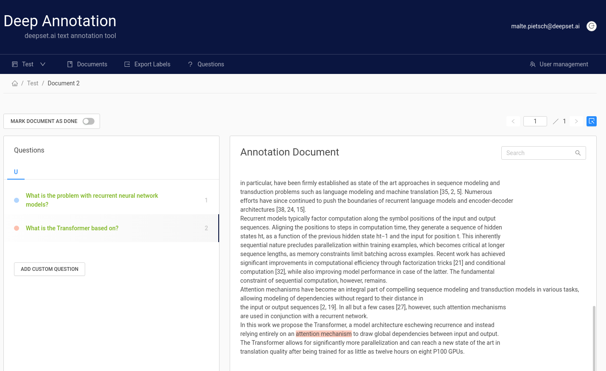

# Annotation Tool

- Create labels with different techniques: Come up with questions (+ answers) while reading passages (SQuAD style) or have a set of predefined questions and look for answers in the document (~ Natural Questions).
- Structure your work via organizations, projects, users
- Upload your documents or import a predefined list of questions
- Export your labels in SQuAD Format

# Hosted version
 Signup here: [Haystack Annotation Tool](https://annotate.deepset.ai/login)

# Local version  (Docker)

1. Configure credentials & database in the [`docker-compose.yml`](https://github.com/deepset-ai/haystack/blob/main/annotation_tool/docker-compose.yml):

The credentials should match in database image and application configuration.

    DEFAULT_ADMIN_EMAIL: "example@example.com"
    DEFAULT_ADMIN_PASSWORD: "DEMO-PASSWORD"

    PROD_DB_NAME: "databasename"
    PROD_DB_USERNAME: "somesafeuser"
    PROD_DB_PASSWORD: "somesafepassword"

    POSTGRES_USER: "somesafeuser"
    POSTGRES_PASSWORD: "somesafepassword"
    POSTGRES_DB: "databasename"

2. Run docker-compose by executing `docker-compose up`.

3. The UI should be available at `localhost:7001`.

# Usage
The manual (of a slightly earlier version) can be found [here](https://drive.google.com/file/d/1Wv3OIC0Z7ibHIzOm9Xw_r0gjTFmpl-33/view). While it doesn't include all latest features, the basic workflow and tips for label quality are still the same.

# Annotation FAQ

1. What is a good question?
- A good question is a fact-seeking question that can be answered with an entity (person, organisation, location, etc.) or explanation. A bad question is ambiguous, incomprehensible, dependent on clear false presuppositions, opinion seeking, or not clearly a request for factual information.
- The question should ask about information present in the text passage given. It should not be answerable only with additional knowledge or your interpretation.
-  Do not copy paste answer text into the question. Good questions do not contain the exact same words as the answer or the context around the answer. The question should be a reformulation with synonyms and in different order as the context of the answer.
- Questions should be very precise natural questions you would ask when you want information from another person.
2. How many questions should you ask per text passage?
- Maximally ask 20 questions per passage
- Some text passages are not suited for 20 questions. Do not make up very constructed and complicated questions just to fill up the 20 - move on to the next text.
- Try to ask questions covering the whole passage and focus on questions covering important information. Do not only ask questions about a single sentence in that passage.
3. What is a good answer span?
- Always mark whole words. Do not start or end the answer within a word.
- For short answers: The answer should be as short and as close to a spoken human answer as possible. Do not include punctuation.
- For long answers: Please mark whole sentences with punctuation. The sentences can also pick up parts of the question, or mark even whole text passages. Mark passages only if they are not too large (e.g. not more than 8-10 sentences).
4. How do I differentiate long vs short answers?
- If there is a short answer possible you should always select short answer over long answer.
- Short precise answers like numbers or a few words are short answers.
- Long answers include lists of possibilities or multiple sentences are needed to answer the question correctly.
5. How to handle multiple possible answers to a single question?
- As of now there is no functionality to mark multiple answers per single question.
- Workaround: You can add a question with the same text but different answer selection by using the button below the question list (Button reads “custom question”)
6. What to do with grammatically wrong or incorrectly spelled questions?
- Include them. When users use the tool and ask questions they will likely contain grammar and spelling errors, too.
- Exception: The question needs to be understandable without reading and interpretation of the corresponding text passage. If you do not understand the question, please mark the question as “I don’t understand the question”.
7. What to do with text passages that are not properly converted or contain (in part) information that cannot be labelled (e.g. just lists or garbage text)?
- Please do not annotate this text
- You can write down what is missing, or the cause why you cannot label the text + the text number and title.
8. Which browser to use?
- Please use the Chrome browser. The tool is not tested for other browsers.
