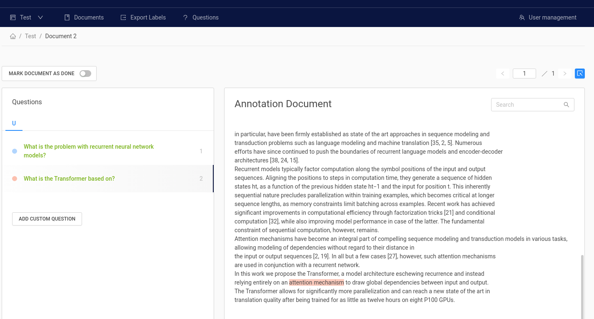

# Annotation Tool

- Create labels with different techniques: Come up with questions (+ answers) while reading passages (SQuAD style) or have a set of predefined questions and look for answers in the document (~ Natural Questions).
- Structure your work via organizations, projects, users
- Upload your documents or import labels from an existing SQuAD-style dataset
- Export your labels in SQuAD Format

# Hosted version
 Signup here: [Haystack Annotation Tool](https://annotate.deepset.ai/login)

# Local version  (Docker)

1. Configure credentials & database in the [`docker-compose.yml`](https://github.com/deepset-ai/haystack/blob/master/annotation_tool/docker-compose.yml):

The credentials should match in database image and application configuration.

    DEFAULT_ADMIN_EMAIL: "example@example.com"
    DEFAULT_ADMIN_PASSWORD: "DEMO-PASSWORD"

    PROD_DB_NAME: "databasename"
    PROD_DB_USERNAME: "somesafeuser"
    PROD_DB_PASSWORD: "somesafepassword"

    POSTGRES_USER: "somesafeuser"
    POSTGRES_PASSWORD: "somesafepassword"
    POSTGRES_DB: "databasename"

2. Run docker-compose by executing `docker-compose up`.

3. The UI should be available at `localhost:7001`.