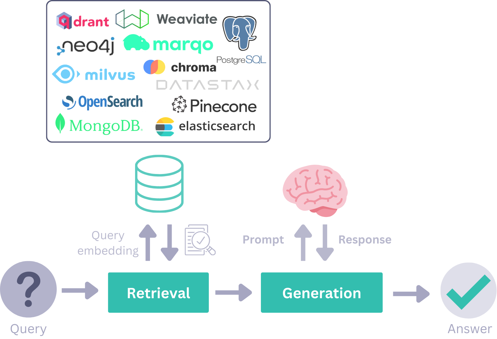

## Components

Haystack offers various components, each performing different kinds of tasks. You can see the whole variety in the **PIPELINE COMPONENTS** section in the left-side navigation. These are often powered by the latest Large Language Models (LLMs) and transformer models. Code-wise, they are Python classes with methods you can directly call. Most commonly, all you need to do is initialize the component with the required parameters and then run it with a `run()` method.

Working on this level with Haystack components is a hands-on approach. Components define the name and the type of all of their inputs and outputs. The Component API reduces complexity and makes it easier to [create custom components](/docs/custom-components), for example, for third-party APIs and databases. Haystack validates the connections between components before running the pipeline and, if needed, generates error messages with instructions on fixing the errors.

### Generators

[Generators](/docs/generators) are responsible for generating text responses after you give them a prompt. They are specific for each LLM technology (OpenAI, Cohere, local models, and others). There are two types of Generators: chat and non-chat:

- The chat ones enable chat completion and are designed for conversational contexts. It expects a list of messages to interact with the user.
- The non-chat Generators use LLMs for simpler text generation (for example, translating or summarizing text).

Read more about various Generators in our [guides](/docs/choosing-the-right-generator).

### Retrievers

[Retrievers](/docs/retrievers) go through all the documents in a Document Store, select the ones that match the user query, and pass it on to the next component. There are various Retrievers that are customized for specific Document Stores. This means that they can handle specific requirements for each database using customized parameters.

For example, for Elasticsearch Document Store, you will find both the Document Store and Retriever packages in its GitHub [repo](https://github.com/deepset-ai/haystack-core-integrations/tree/main/integrations/elasticsearch).

## Document Stores

[Document Store](/docs/document-store) is an object that stores your documents in Haystack, like an interface to a storage database. It uses specific functions like `write_documents()` or `delete_documents()` to work with data. Various components have access to the Document Store and can interact with it by, for example, reading or writing Documents.

If you are working with more complex pipelines in Haystack, you can use a [`DocumentWriter`](/docs/documentwriter) component to write data into Document Stores for you

## Data Classes

You can use different [data classes](/docs/data-classes) in Haystack to carry the data through the system. The data classes are mostly likely to appear as inputs or outputs of your pipelines.

`Document` class contains information to be carried through the pipeline. It can be text, metadata, tables, or binary data. Documents can be written into Document Stores but also written and read by other components.

`Answer` class holds not only the answer generated in a pipeline but also the originating query and metadata.

## Pipelines

Finally, you can combine various components, Document Stores, and integrations into [pipelines](/docs/pipelines) to create powerful and customizable systems. It is a highly flexible system that allows you to have simultaneous flows, standalone components, loops, and other types of connections. You can have the preprocessing, indexing, and querying steps all in one pipeline, or you can split them up according to your needs.

If you want to reuse pipelines, you can save them into a convenient format (YAML, TOML, and more) on a disk or share them around using the [serialization](/docs/serialization) process.

Here is a short Haystack pipeline, illustrated:

