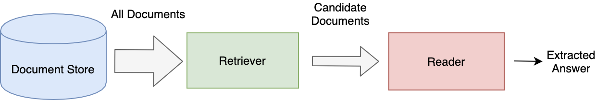

Conceptual Overview
===================

Retriever-Reader Pipeline
-------------------------

Queries in Haystack are processed in two distinct stages handled by a **Retriever** and a **Reader**.

**Readers**, also known as Open-Domain QA systems in Machine Learning speak,
are powerful models that do close analysis of documents and perform the core task of question answering.
The Readers in Haystack are trained from the latest transformer based language models and can be significantly sped up using GPU acceleration.
However, it is not currently feasible to use the Reader directly on large collection of documents.

..
   _comment: !! benchmarks link !!

..
   _comment: !! Image of What a reader does and maybe architecture !!

The **Retriever** assists the Reader by acting as a lightweight filter that reduces the number of documents that the Reader has to process.
It does this by:

* Scanning through all documents in the database
* Quickly identifying the relevant and dismissing the irrelevant
* Passing on only a small candidate set of documents to the Reader

Current methods fall into one of the two categories:

* sparse
    - keyword based
    - fast indexing and querying

* dense
    - neural network based
    - computationally heavy indexing but fast querying

Indexing and Querying
---------------------

To **index** is to store your documents in a way that will optimize your search.
It is performed just once, at the point of loading the data into your database.
For **sparse** keyword based retrievers, this involves the creation of an inverted index that maps words to the documents which contain them.
For **dense** neural network based retrievers, indexing involves computing the document embeddings which will be compared against the query embedding.

..
   _comment: !! Diagrams of inverted index / document embeds !!

Here is an example of how you index your documents in Haystack using an ``ElasticsearchDocumentStore``.

..
   _comment: !! Make this a tab element to show how different datastores are initialized !!

.. code-block::

    # Database to store your docs
    document_store = ElasticsearchDocumentStore()

    # Clean & index your docs
    dicts = convert_files_to_dicts(doc_dir, clean_func=clean_wiki_text)
    document_store.write_documents(dicts)

**Querying** involves searching for an answer to a given question within the full document store.
This process will:
* make the Retriever filter for a small set of relevant candidate documents
* get the Reader to process this set of candidate documents
* return potential answers to the given question

Generally speaking, there are much tighter time constraints on querying and so it is a much more lightweight operation.
Indexing should precompute any of the results that might be useful at query time.

In Haystack, querying is performed with a ``Finder`` object which connects the reader to the retriever.

.. code-block::

    # The Finder sticks together reader and retriever in a pipeline to answer our questions.
    finder = Finder(reader, retriever)

    # Voilà! Ask a question!
    question = "Who is the father of Sansa Stark?"
    prediction = finder.get_answers(question)

