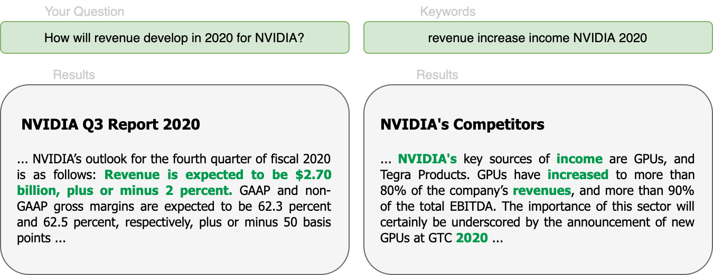

<!---
title: "Use Cases"
metaTitle: "Use Cases"
metaDescription: ""
slug: "/docs/use_cases"
date: "2020-11-16"
id: "use_casesmd"
--->

# Use cases

## Semantic Search System

Take the leap from using keyword search on your own documents to semantic search with Haystack.

* Store your documents in the database of your choice (Elasticsearch, SQL, in memory, FAISS)

* Perform question driven queries.

Expect to see results that highlight the very sentence that contains the answer to your question.
Thanks to the power of Transformer based language models, results are chosen based on compatibility in meaning
rather than lexical overlap.

## Information Extractor

Automate the extraction of relevant information from a set of documents that pertain to the same topics but for different entities.

Haystack can:

* Apply a set of standard questions to each document in a store

* Return a NO_ANSWER if a given document does not contain the answer to a question

Say you have the financial reports for different companies over different years.
You can gather a set of standard questions which are applicable to each financial report,
like *what is the revenue forecast for 2020?* or *what are the main sources of income?*.
Haystack will try to find an answer for each question within each document!

We’ve seen this style of application be particularly effective in the sphere of finance and patent law
but we see a lot of potential in using this to gain a better overview of academic papers and internal business documents.

<!-- _comment: !!Image!! -->
## FAQ Style Question Answering

Leverage existing FAQ documents and semantic similarity search to answer new incoming questions.
The workflow is as follows:

* Store a set of FAQ documents in Haystack

* The user presents a new question

* Haystack will find the closest match to the new question in the FAQ documents

* The user will be presented with the most similar Question Answer pair

Haystack’s flexibility allows you to give new users more dynamic access to your existing documentation.
