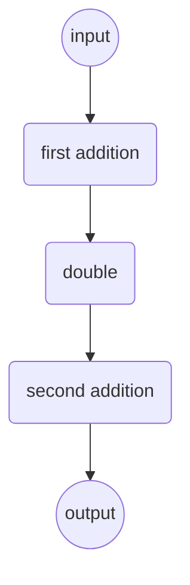

# Basic Concepts

Canals is a **component orchestration engine**. It can be used to connect a group of smaller objects, called Components,
that  perform well-defined tasks into a network, called Pipeline, that achieves a larger goal.

Components are Python objects that can execute a task, like reading a file, performing calculations, or making API
calls. Canals connects these objects together: it builds a graph of components and takes care of managing their
execution order, making sure that each object receives the input it expects from the other components of the pipeline.


Canals relies on two main concepts: Components and Pipelines.

## What is a Component?

A Component is a Python class that performs a well-defined task: for example a REST API call, a mathematical operation,
a data trasformation, writing something to a file or a database, and so on.

To be recognized as Components by Canals, a Python class needs to respect these rules:

1. Must be decorated with the `@component` decorator
2. Must have a `run()` method with a specific signature
3. Must return output that Canals can interpret.

We will see the details of all of these requirements below.

## What is a Pipeline?

A Pipeline is a network of Components. Pipelines define what components receive and send output to which other, makes
sure all the connections are valid, and takes care of calling the component's `run()` method in the right order.

Pipeline connects compoonents together through so-called connections, which are the edges of the pipeline graph.
Each component should declare which inputs it expects, which output it will generate, and Pipeline is going
to make sure that all the connections are valid based on these two elements.

For example, if a component produces a value called `document`, among others, and another component expects an input called `document`, among others, Pipeline will be able to connect them. Otherwise, it will raise an exception.

## Example

This is an example of a Pipeline that performs some mathematical operations combining two components.

```python
from typing import Dict, Any, List, Tuple
from canals import Pipeline, component

@component
class AddValue:
    def __init__(
        self,
        add: int = 1,
        input_name: str = "value",
        output_name: str = "value"
    ):
        self.add = add
        self.init_parameters = {"add": add}
        self.inputs = [input_name]
        self.outputs = [output_name]

    def run(
        self,
        name: str,
        data: List[Tuple[str, Any]],
        parameters: Dict[str, Any],
        stores: Dict[str, Any],
    ):
        my_parameters = parameters.get(name, {})
        add = my_parameters.get("add", self.add)

        for _, value in data:
            value += add

        return ({self.outputs[0]: value}, parameters)


@node
class Double:
    def __init__(self, input_connection: str = "value"):
        self.init_parameters = {"input_connection": input_connection}
        self.inputs = [input_connection]
        self.outputs = [input_connection]

    def run(
        self,
        name: str,
        data: List[Tuple[str, Any]],
        parameters: Dict[str, Any],
        stores: Dict[str, Any],
    ):
        for _, value in data:
            value *= 2

        return ({self.outputs[0]: value}, parameters)


pipeline = Pipeline()

# Components can be initialized as standalone objects.
# These instances can be added to the Pipeline in several places.
addition = AddValue(add=1)

# Components are added with a name and an node. Note the lack of references to
# any other node. Components can store default parameters per node.
pipeline.add_component("first_addition", addition, parameters={"add": 3})
pipeline.add_component("second_addition", addition)  # Instances can be reused
pipeline.add_component("double", Double())

# Components are the connected as input node: [list of output components]
pipeline.connect(connect_from="first_addition", connect_to="double")
pipeline.connect(connect_from="double", connect_to="second_addition")

pipeline.draw("pipeline.png")

# Pipeline.run() accepts 'data' and 'parameters' only. Such dictionaries can
# contain anything, depending on what the first component(s) of the pipeline
# requires. Pipeline does not validate the input: every component(s) should
# do so.
results = pipeline.run(
    data={"value": 1},
    # Parameters can be passed at this stage as well
    parameters = {"second_addition": {"add": 10}}
)
assert results == {"value": 18}
```

The result of `Pipeline.draw()`:



## How do I create a Component?

In order to be recognized as components and work in a Pipeline, Components must follow the contract below.

### Decorator

All component classes must be decorated with the `@component` decorator. This allows Canals to discover them.

### __init__

```python
def __init__(self, [... components init parameters ...]):
```

The constructor is a mandatory method for Canals components.

In their `__init__`, Components must define:

- `self.inputs = [<expected_input_connection_name(s)>]`:
    A list with all the connections they can possibly receive input from

- `self.outputs = [<expected_output_connection_name(s)>]`:
    A list with the connections they might possibly produce as output

- `self.init_parameters = {<init parameters>}`:
    Any state they wish to be persisted when they are marshalled.
    These values will be given to the `__init__` method of a new instance
    when the pipeline is unmarshalled.

If components want to let users customize their input and output connections (be it
the connection name, the connection count, etc...) they should provide properly
named init parameters:

- `input: str` or `inputs: List[str]` (always with proper defaults)
- `output: str` or `outputs: List[str]` (always with proper defaults)

All the rest is going to be interpreted as a regular init parameter that
has nothing to do with the component connections.

The `__init__` must be extrememly lightweight, because it's a frequent
operation during the construction and validation of the pipeline. If a component
has some heavy state to initialize (models, backends, etc...) refer to the
`warm_up()` method.

### `warm_up()`

```python
def warm_up(self):
```

Optional method. If it's defined, this method is called by Pipeline before the graph execution.
Make sure to avoid double-initializations, because Pipeline will not keep track of which components it called
`warm_up()` on.

### `run()`

```python
def run(
    self,
    name: str,
    data: List[Tuple[str, Any]],
    parameters: Dict[str, Dict[str, Any]],
):
```

This is the method that is called by `Pipeline.run()`. When calling it, Pipeline passes the following parameters to it:

- `name: str`: the name of the component. Allows the component to find its own parameters in
    the `parameters` dictionary (see below).

- `data: List[Tuple[str, Any]]`: the input data.
    Pipeline guarantees that the following assert always passes:

    `assert self.inputs == [name for name, value in data]`

    which means that:
    - `data` is of the same length as `self.inputs`.
    - `data` contains one tuple for each string stored in `self.inputs`.
    - no guarantee is given on the values of these tuples: notably, if there was a
        decision component upstream, some values might be `None`.

    For example, if a component declares `self.inputs = ["value", "value"]` (think of a
    `Sum` component), `data` might look like:

    `[("value", 1), ("value", 10)]`

    `[("value", None), ("value", 10)]`

    `[("value", None), ("value", None)]`

    `[("value", 1), ("value", ["something", "unexpected"])]`

    but it will never look like:

    `[("value", 1), ("value", 10), ("value", 100)]`

    `[("value": 15)]`

    `[("value": 15), ("unexpected", 10)]`

- `parameters: Dict[str, Dict[str, Any]]`: a dictionary of dictionaries with all
    the parameters for all components in the Pipeline.
    Note that all components have access to all parameters for all other components: this
    might come handy to components that want to influence the behavior
    of other components downstream.
    Components can access their own parameters using `name`, but they must **not** assume
    their name is present in the dictionary.
    Therefore, the best way to get the parameters is with
    `my_parameters = parameters.get(name, {})`

Pipeline expect the output of this function to be a tuple of two dictionaries.
The first item is a dictionary that represents the output and it should always
abide to the following format:

`{output_name: output_value for output_name in <subset of self.expected_output>}`

Which means that:
- Components are not forced to produce output on all the expected outputs: for example,
    components taking a decision, like classifiers, can produce output on a subset of
    the expected output connections and Pipeline will figure out the rest.
- Components must not add any key in the data dictionary that is not present in `self.outputs`.

The second item of the tuple is the `parameters` dictionary. This allows component to
propagate downstream any change they might have done to the `parameters` dictionary.


## Topologies

Canals supports a variety of different pipeline topologies. Check the pipeline's test suite for some examples:
these are only representations of the graphs that those pipelines generate.
