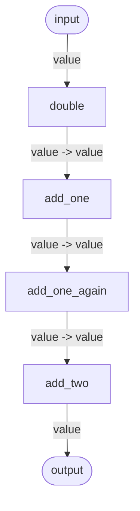

# Core concepts

Canals is a **component orchestration engine**. It can be used to connect a group of smaller objects, called Components,
that perform well-defined tasks into a network, called Pipeline, to achieve a larger goal.

Components are Python objects that can execute a task, like reading a file, performing calculations, or making API
calls. Canals connects these objects together: it builds a graph of components and takes care of managing their
execution order, making sure that each object receives the input it expects from the other components of the pipeline.

Canals relies on two main concepts: Components and Pipelines.

## What is a Component?

A Component is a Python class that performs a well-defined task: for example a REST API call, a mathematical operation,
a data trasformation, writing something to a file or a database, and so on.

To be recognized as a Component by Canals, a Python class needs to respect these rules:

1. Must be decorated with the `@component` decorator.
3. Have a `run()` method with all the inputs and outputs typed.
4. Must return a pre-defined dataclass called `Output`.

For example, the following is a Component that sums up two numbers:

```python
from dataclasses import dataclass
from canals import component

@component
class AddTwoValues:
    """
    Adds the value of `add` to `value`. If not given, `add` defaults to 1.
    """

    @dataclass
    class Output:
        value: int

    def __init__(self, add: int = 1):
        self.defaults = {"add": add}

    def run(self, value: int, add: int) -> Output:
        return AddTwoValues.Output(value=value + add)
```

We will see the details of all of these requirements below.

## What is a Pipeline?

A Pipeline is a network of Components. Pipelines define what components receive and send output to which other, makes
sure all the connections are valid, and takes care of calling the component's `run()` method in the right order.

Pipeline connects compoonents together through so-called connections, which are the edges of the pipeline graph.
Pipeline is going to make sure that all the connections are valid based on the inputs and output that Components have
declared.

For example, if a component produces a value of type `List[Document]` and another component expects an input
of type `List[Document]`, Pipeline will be able to connect them. Otherwise, it will raise an exception.

This is a simple example of how a Pipeline is created:


```python
from canals import Pipeline, component

# Some Canals components
from my_components import AddTwoValues, MultiplyTwoValues

pipeline = Pipeline()

# Components can be initialized as standalone objects.
# These instances can be added to the Pipeline in several places.
multiplication = MultiplyBy(multiply_by=2)
addition = AddTwoValues(add=1)

# Components are added with a name and an component
pipeline.add_component("double", multiplication)
pipeline.add_component("add_one", addition)
pipeline.add_component("add_one_again", addition)  # Component instances can be reused
pipeline.add_component("add_two", AddTwoValues(add=2))

# Connect the components together
pipeline.connect(connect_from="double", connect_to="add_one")
pipeline.connect(connect_from="add_one", connect_to="add_one_again")
pipeline.connect(connect_from="add_one_again", connect_to="add_two")

# Pipeline can be drawn
pipeline.draw("pipeline.jpg")

# Pipelines are run by giving them the data that the input nodes expect.
results = pipeline.run(data={"double":{"value": 1}})

print(results)

# prints {"add_two": {"value": 6}}
```

This is how the pipeline's graph looks like:


