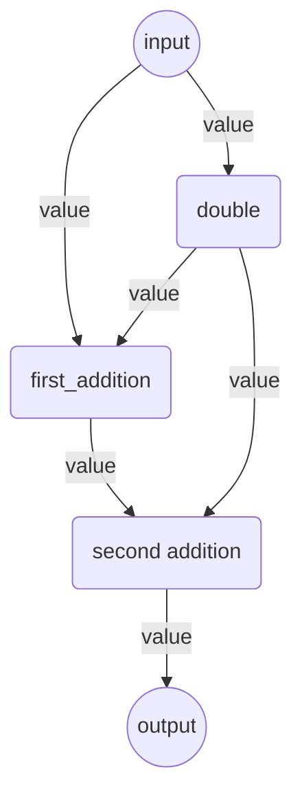

# Components and Pipelines

Canals is a **component orchestration engine**. It can be used to connect a group of smaller objects, called Components,
that perform well-defined tasks into a network, called Pipeline, to achieve a larger goal.

Components are Python objects that can execute a task, like reading a file, performing calculations, or making API
calls. Canals connects these objects together: it builds a graph of components and takes care of managing their
execution order, making sure that each object receives the input it expects from the other components of the pipeline.

Canals relies on two main concepts: Components and Pipelines.

## What is a Component?

A Component is a Python class that performs a well-defined task: for example a REST API call, a mathematical operation,
a data trasformation, writing something to a file or a database, and so on.

To be recognized as a Component by Canals, a Python class needs to respect these rules:

1. Must be decorated with the `@component` decorator
2. Declare its inputs and outputs in the `__init__` function.
3. Must have a `run()` method with a specific signature
4. Must return output that Canals can interpret.

For example, the following is a Component that sums up all its inputs:

```python
from canals import component

# The mandatory 'component' decorator
@component
class Sum:
    """
    A Canals component that takes some input numbers and outputs their sum.
    """

    def __init__(
        self,
        input_names: str = ["first_number", "second_number"],
        output_name: str = "value"
    ):
        # self.inputs and self.outputs are required by Canals
        self.inputs = input_names
        self.outputs = [output_name]
        self.init_parameters = {"input_names": input_names, "output_name": output_name}

    # The signature of the run() method must be exactly this.
    def run(
        self,
        name: str,  # The name of the component in the pipeline
        data: List[Tuple[str, Any]],    # The data from other components
        parameters: Dict[str, Any],     # All the parameters of all the nodes in the pipeline
    ):
        # Let's sum the values of all the inputs we've got
        for _, value in data:
            value += add

        # We declared one output in the __init__, so the output should be:
        # - a dictionary with that key
        # - the parameters dictionary we received in input.
        return ({self.outputs[0]: value}, parameters)
```

We will see the details of all of these requirements below.

## What is a Pipeline?

A Pipeline is a network of Components. Pipelines define what components receive and send output to which other, makes
sure all the connections are valid, and takes care of calling the component's `run()` method in the right order.

Pipeline connects compoonents together through so-called connections, which are the edges of the pipeline graph.
Pipeline is going to make sure that all the connections are valid based on the inputs and output that Components have
declared (with their `self.inputs` and `self.outputs` attributes).

For example, if a component produces a value called `document`, among others, and another component expects an input
called `document`, among others, Pipeline will be able to connect them. Otherwise, it will raise an exception.

This is a simple example of how a Pipeline is created:


```python
from canals import Pipeline, component

# Some Canals components
from my_components import Sum, MultiplyBy

#
pipeline = Pipeline()

# Components can be initialized as standalone objects.
# These instances can be added to the Pipeline in several places.
multiplication = MultiplyBy(input_name="value", output_name="value", multiply_by=2)
addition = Sum(input_names=["value", "value"], output_name="value")

# Components are added with a name and an component
pipeline.add_component("double", multiplication, input_component=True)
pipeline.add_component("first_addition", addition, input_component=True)
pipeline.add_component("second_addition", addition)  # Component instances can be reused

# Connect the components together
pipeline.connect(connect_from="double", connect_to="first_addition")
pipeline.connect(connect_from="double", connect_to="second_addition")
pipeline.connect(connect_from="first_addition", connect_to="second_addition")

# Pipelines are run by giving them the data that the input nodes expect.
results = pipeline.run(data={"value": 1})

print(results)

# prints {"value": 5}
```

This is how the pipeline's graph looks like:


