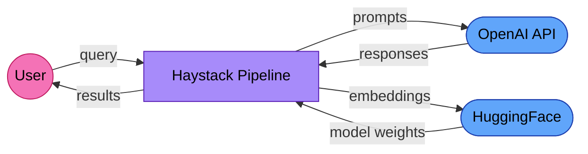

# EU AI Act Compliance Guide for Haystack Deployers

Haystack is a framework. The EU AI Act regulates AI *systems*, not frameworks. But if you deploy a Haystack pipeline in the EU, you become a deployer (or provider, depending on your modifications) under the Act.

This guide covers what the regulation requires, what Haystack already provides, and what you need to add.

## Who this applies to

The EU AI Act applies to AI systems placed on the EU market or used within the EU, regardless of where the provider is based. If your Haystack pipeline serves EU users or processes EU residents' data, these obligations apply.

**deepset** (Haystack's creator) is a framework provider. Under Articles 25-27, framework providers have limited obligations unless they market the framework as a complete AI system. The compliance burden falls primarily on **deployers**: organizations that build and operate Haystack pipelines for specific use cases.

## Risk classification

Not all AI systems face the same requirements. The AI Act defines four risk tiers:

| Risk Level | Examples | Requirements |
|-----------|---------|-------------|
| Unacceptable | Social scoring, real-time biometric identification | Prohibited |
| High-risk | HR screening, credit scoring, legal assistance, critical infrastructure | Full compliance (Articles 9-15) |
| Limited risk | Chatbots, emotion detection | Transparency obligations (Article 52) |
| Minimal risk | Spam filters, content recommendations | No specific obligations |

**Your pipeline's risk level depends on its use case, not on the framework.** A Haystack RAG pipeline answering customer questions about product features is likely minimal risk. The same architecture used to screen job applications is high-risk.

If your system is high-risk, the August 2, 2026 deadline for full compliance applies.

## What the scanner found

Running [AI Trace Auditor](https://github.com/BipinRimal314/ai-trace-auditor) (`aitrace comply`) against the Haystack codebase:

- **Files scanned:** 573
- **AI providers detected:** OpenAI, HuggingFace
- **Model identifiers:** 15 (including gpt-4o, gpt-4-turbo, whisper-1, dall-e-3, text-embedding-ada-002)
- **External services:** 3
- **Auto-populated Annex IV sections:** 33%

These are the providers and models Haystack *supports*. Your deployment will use a subset. Document which ones are active in your system.

## Data flow diagram

When a Haystack pipeline calls an external LLM provider, user data leaves your infrastructure:



**GDPR roles:**
- **Your organization:** Controller (you determine the purpose and means of processing)
- **OpenAI / Azure OpenAI:** Processor (processes data on your behalf). Requires a Data Processing Agreement under GDPR Article 28.
- **HuggingFace:** Processor if using Inference API; no data transfer if running models locally.
- **Self-hosted models (Ollama, vLLM):** No third-party transfer. You remain controller with no processor relationship.

Your actual data flow depends on which components you use. Adapt this diagram to your deployment.

## Article 11: Technical documentation (Annex IV)

High-risk AI systems require technical documentation *before* market placement. Annex IV specifies 9 sections. Here is what can be auto-populated from a Haystack deployment and what requires your input:

| Section | What the tool provides | What you must add |
|---------|----------------------|-------------------|
| 1. General description | Detected providers, models, endpoints | Intended purpose, target users, version history |
| 2. Development process | SDK versions, model identifiers, component list | Algorithm rationale, design choices, development methodology |
| 3. Monitoring and control | Existing tracing coverage (if traces provided) | Human oversight measures, override mechanisms |
| 4. Performance metrics | Evaluation metrics in code (if present) | Metric selection rationale, fairness measures, thresholds |
| 5. Risk management | Known risk surfaces (API dependencies, data flows) | Risk assessment methodology, mitigations, residual risks |
| 6. Lifecycle changes | Model versions from traces (if provided) | Change management process, update validation |
| 7. Applied standards | — | ISO/IEC 42001, ISO/IEC 23894, etc. |
| 8. Declaration of conformity | — | Provider details, risk classification, signatory |
| 9. Post-market monitoring | Logging coverage from traces (if provided) | Monitoring plan, incident response, feedback collection |

Generate a starting template:

```bash
pip install ai-trace-auditor
aitrace docs ./your-haystack-project -o annex-iv-docs.md
```

## Article 12: Record-keeping

Article 12 requires automatic event recording over the lifetime of high-risk AI systems. Haystack's tracing infrastructure covers some of these requirements:

| Requirement | Haystack feature | Status |
|------------|-----------------|--------|
| Event timestamps | `Tracer` records span start/end | Covered |
| Model version tracking | Logged in component metadata | Covered |
| Input/output logging | Configurable via `LoggingTracer` | Opt-in |
| Error recording | Exception handling in pipeline | Partial |
| Token consumption | Tracked by LLM components | Covered |
| Operation latency | Span duration in tracing | Covered |
| Data retention (6+ months) | Depends on your tracing backend | Your responsibility |

Audit your traces against Article 12:

```bash
aitrace audit your-traces.json -r "EU AI Act" -o audit-report.md
```

## Article 13: Transparency

You must provide clear information to users about:
- That they are interacting with an AI system
- The system's capabilities and limitations
- How it was trained and what data it uses
- How to interpret its output

For RAG pipelines, this includes documenting:
- Which documents are in the knowledge base
- How retrieval affects the response
- Confidence levels or source attribution
- When the system might hallucinate or give incomplete answers

## GDPR considerations

If your pipeline processes personal data (user queries, documents containing personal information):

1. **Legal basis** (Article 6): Document why you're processing this data (consent, legitimate interest, contract)
2. **Data Processing Agreements** (Article 28): Required for each cloud AI provider
3. **Record of Processing Activities** (Article 30): Document each processing activity, purpose, data categories, and recipients
4. **Data Protection Impact Assessment** (Article 35): Required if processing poses high risk to individuals

Generate a GDPR Article 30 template:

```bash
aitrace flow ./your-haystack-project -o data-flows.md
```

## Recommendations

1. **Determine your risk classification** before investing in compliance. Most RAG chatbots are minimal/limited risk.
2. **Use self-hosted models** (Ollama, vLLM) to eliminate third-party data transfers where possible.
3. **Enable Haystack's tracing** and connect it to a persistent backend (Jaeger, Datadog) for Article 12 compliance.
4. **Document your specific deployment**, not the framework. The regulator evaluates your system, not Haystack.
5. **Re-run compliance checks** when you change models, providers, or pipeline architecture.

## Resources

- [EU AI Act full text](https://artificialintelligenceact.eu/)
- [Haystack tracing documentation](https://docs.haystack.deepset.ai/docs/tracing)
- [AI Trace Auditor](https://github.com/BipinRimal314/ai-trace-auditor) — open-source compliance scanning
- [EU AI Office guidance](https://digital-strategy.ec.europa.eu/en/policies/regulatory-framework-ai)

---

*This guide was generated with assistance from [AI Trace Auditor](https://github.com/BipinRimal314/ai-trace-auditor) and reviewed for accuracy. It is not legal advice. Consult a qualified professional for compliance decisions.*
