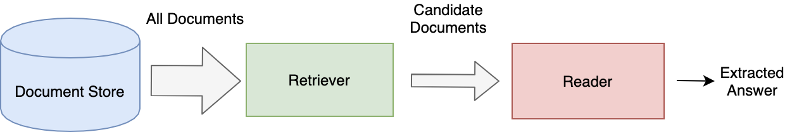

<!---
title: "What is Haystack"
metaTitle: "What is Haystack"
metaDescription: ""
slug: "/docs/intro"
date: "2020-09-03"
id: "intromd"
--->

# What is Haystack?

Haystack is an **open-source framework** for building **search systems** that work intelligently over large document collections.
Recent advances in NLP have enabled the application of question answering, retrieval and summarization to real world settings
and Haystack is designed to be the bridge between research and industry.

* **Latest NLP models**: Utilize all transformer based models (BERT, RoBERTa, MiniLM, DPR ...) and smoothly switch when new ones get published

* **Flexible databases**: Load data into and query from a range of databases such as Elasticsearch, Milvus, FAISS, SQL and more

* **Scalability**: Production-ready deployments that scale to millions of documents

* **End-to-End**: All tooling you need to implement, evaluate, improve and run a search system

* **Domain adaptation**: Fine-tune models to your own domain & improve them continuously via user feedback

## Retriever-Reader

The most common system built with Haystack is the Retriever-Reader Pipeline which is designed to optimize for both
speed and performance on the task of Open Domain Question Answering.
In practice, this is a great back bone for creating a search system that can handle detailed full sentence queries.
 

**Readers**, also known as Open-Domain QA systems in Machine Learning speak,
are powerful models that do close analysis of documents and perform the core task of question answering.
The Readers in Haystack are trained from the latest transformer based language models and can be significantly sped up using GPU acceleration.
However, it is not currently feasible to use the Reader directly on large collection of documents.

<!-- _comment: !! benchmarks link !! -->
<!-- _comment: !! Image of What a reader does and maybe architecture !! -->
The **Retriever** assists the Reader by acting as a lightweight filter that reduces the number of documents that the Reader has to process.
It does this by:

* Scanning through all documents in the database

* Quickly identifying the relevant and dismissing the irrelevant

* Passing on only a small candidate set of documents to the Reader

Current methods fall into one of the two categories:

* sparse
     * keyword based
     * fast indexing and querying
     * e.g. BM25

* dense
     * neural network based
     * computationally heavy indexing but fast querying
     * e.g. Dense Passage Retrieval
