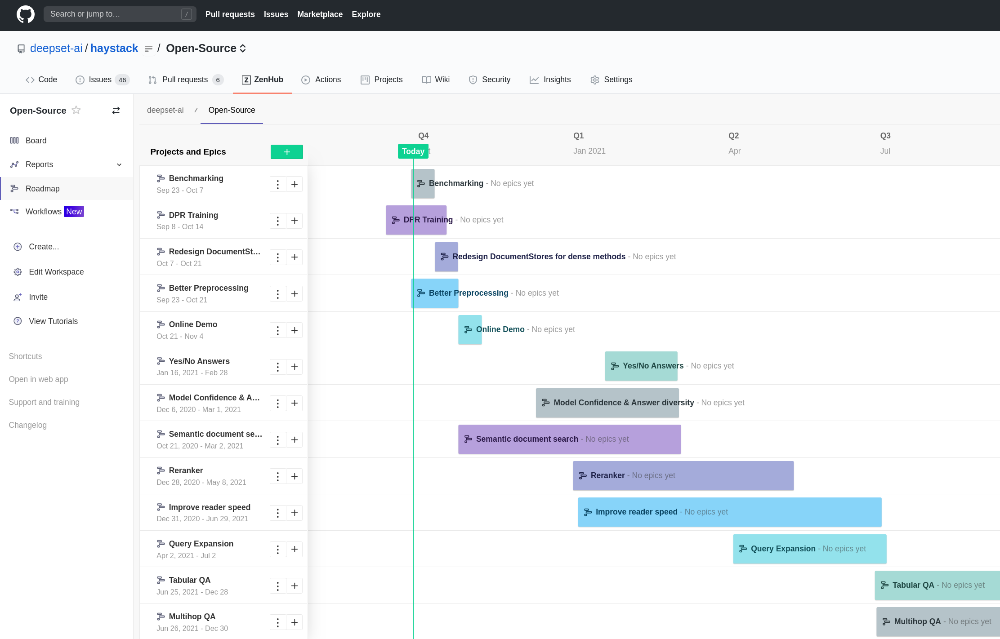
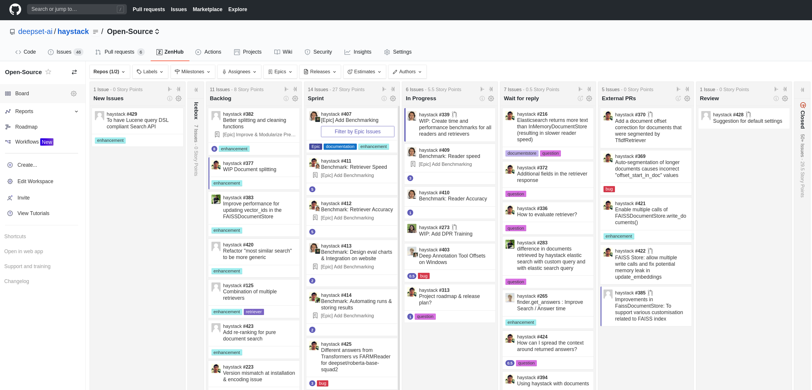
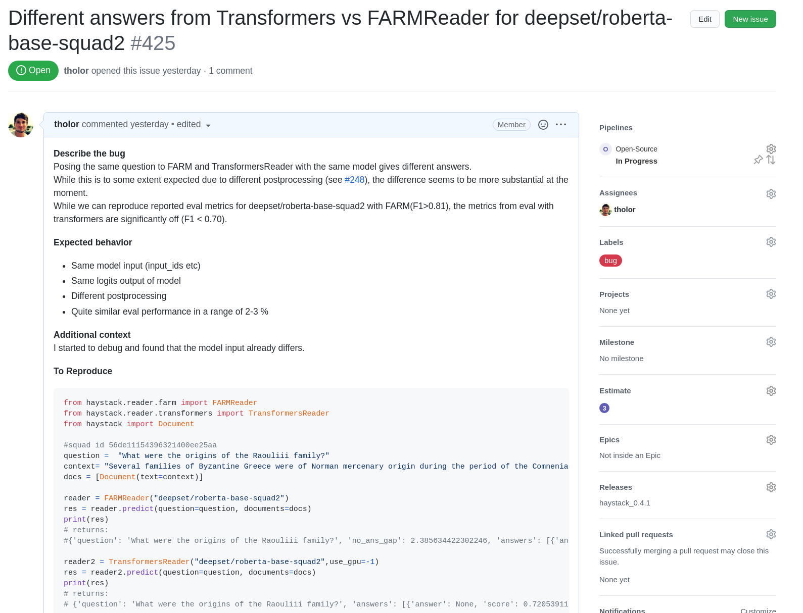

<!---
title: "Roadmap"
metaTitle: "Roadmap and Zenhub Access"
metaDescription: "How to access our open roadmap"
slug: "/docs/roadmap"
date: "2020-09-24"
id: "roadmapmd"
--->

# Open roadmap

We believe open-source is more than open source code. It's a lot about people, collaboration, transparency and trust. 
Therefore, we decided to be as open as possible with our roadmap and sprint planning. 
In fact, you can see all of it in real-time on GitHub. 
We hope this helps to clarify the direction of the open-source project and inspires discussions in the community. 

## How to access it

### Add Zenhub Plugin
We decided for Zenhub, as it allows a close integration with GitHub and real-time sharing of roadmaps and sprints.
Once you have installed the browser plugin below, you will see additional tabs and infos on the Haystack GitHub page.

Zenhub Plugin: https://www.zenhub.com/extension 

### Roadmap
_Zenhub Tab -> Roadmap (left menu)_

Here you can find our most recent roadmap with the **high-level projects** that are planned for the upcoming quarters.
We update it regularly and refine the projects as they come closer in time. 
 

### Board
_Zenhub Tab -> Board (left menu)_

If you are interested in the **operational tasks** and their status, you can find our agile board here. 

### Additional issue details & Releases
_Right panel in regular Github issues_

With Zenhub you can also see some additional tags in every GitHub issue. 
For those of you who wonder about the next release date: We aim for releases every ~ 4 weeks and will tag the issues that will need to be finished before a bit in advance. 

