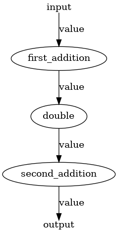
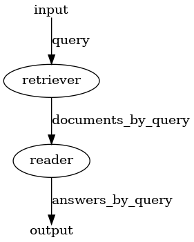
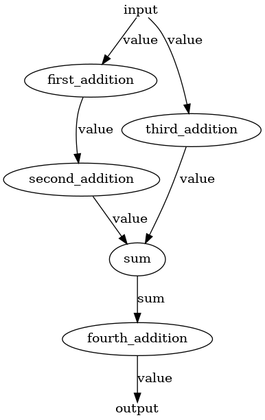
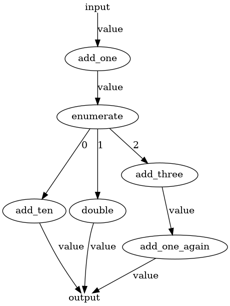
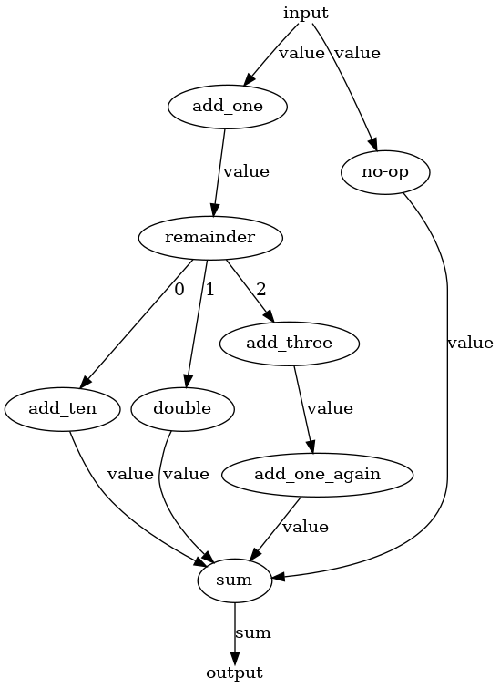
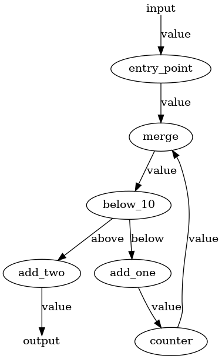
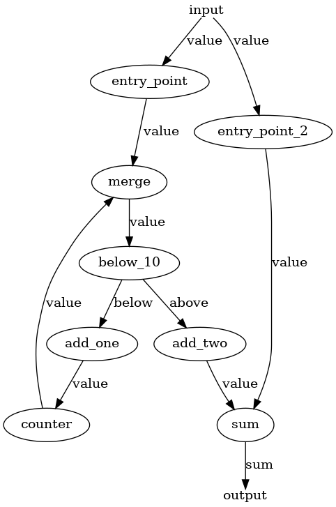
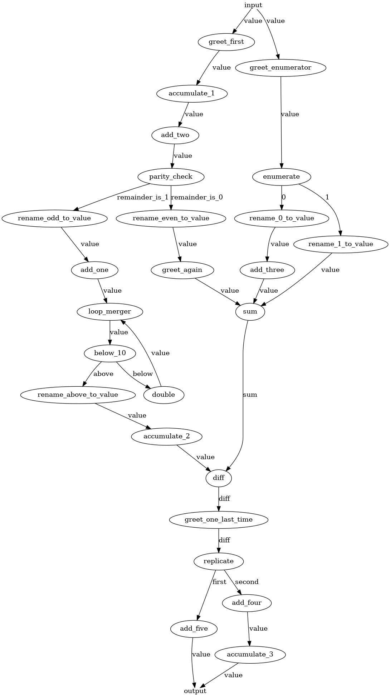

- Title: Drop `BaseComponent` and reimplement `Pipeline`.
- Decision driver: @ZanSara
- Start Date: 27/02/2023
- Proposal PR: #4284
- Github Issue or Discussion: #2807

# Summary

Haystack Pipelines are very powerful objects, but they still have a number of unnecessary limitations, by design and by implementation.

This proposal aims to address most of the implementation issues, some fundamental assumptions like the need for DAGs and the `BaseComponent` class, and proposes a solution for the question of `DocumentStore`'s status with respect to the `Pipeline`.


# Motivation

Pipelines are the fundamental component of Haystack and one of its most powerful concepts. At its core, a Pipeline is a DAG (Directed Acyclic Graph) of objects called Nodes, or Components, each of whom executes a specific transformation on the data flowing along the pipeline. In this way, users can combine powerful libraries, NLP models, and simple Python snippets to connect a herd of tools into a one single, coherent object that can fulfill an infinite variety of tasks.

However, as it currently stands, the `Pipeline` object is also imposing a number of limitations on its use, most of which are likely to be unnecessary. Some of these include:

- DAGs. DAGs are safe, but loops could enable many more usecases, like `Agents`.

- `Pipeline` can select among branches, but cannot run such branches in parallel, except for some specific and inconsistent corner cases. For further reference and discussions on the topic, see:
    - https://github.com/deepset-ai/haystack/pull/2593
    - https://github.com/deepset-ai/haystack/pull/2981#issuecomment-1207850632
    - https://github.com/deepset-ai/haystack/issues/2999#issuecomment-1210382151

- `Pipeline`s are forced to have one single input and one single output node, and the input node has to be called either `Query` or `Indexing`, which softly forbids any other type of pipeline.

- The fixed set of allowed inputs (`query`, `file_paths`, `labels`, `documents`, `meta`, `params` and `debug`) blocks several usecases, like summarization pipelines, translation pipelines, even some sort of generative pipelines.

- `Pipeline`s are often required to have a `DocumentStore` _somewhere_ (see below), even in situation where it wouldn't be needed.
  - For example, `Pipeline` has a `get_document_store()` method which iterates over all nodes looking for a `Retriever`.

- The redundant concept of `run()` and `run_batch()`: nodes should take care of this distinction internally if it's important, otherwise run in batches by default.

- The distinction between a `Pipeline` and its YAML representation is confusing: YAMLs can contain several pipelines, but `Pipeline.save_to_yaml()` can only save a single pipeline.

In addition, there are a number of known bugs that makes the current Pipeline implementation hard to work with. Some of these include:

- Branching and merging logic is known to be buggy even where it's supported.
- Nodes can't be added twice to the same pipeline in different locations, limiting their reusability.
- Pipeline YAML validation needs to happen with a YAML schema because `Pipeline`s can only be loaded along with all their nodes, which is a very heavy operation. Shallow or lazy loading of nodes doesn't exist.
- Being forced to use a schema for YAML validation makes impossible to validate the graph in advance.

On top of these issues, there is the tangential issue of `DocumentStore`s and their uncertain relationship with `Pipeline`s. This problem has to be taken into account during a redesign of `Pipeline` and, if necessary, `DocumentStore`s should also be partially impacted. Some of these issues include:

- `DocumentStore`s are nodes in theory, but in practice they can be added to `Pipeline`s only to receive documents to be stored. On the other hand, `DocumentStore`'s most prominent usecase is as a _source_ of documents, and currently they are not suited for this task without going through an intermediary, most often a `Retriever` class.
  - The relationship between `DocumentStore` and `Retriever` should be left as a topic for a separate proposal but kept in mind, because `Retriever`s currently act as the main interface for `DocumentStore`s into `Pipeline`s.

This proposal tries to adress all the above point by taking a radical stance with:

- A full reimplementation of the `Pipeline` class that does not limit itself to DAGs, can run branches in parallel, can skip branches and can process loops safely.

- Dropping the concept of `BaseComponent` and introducing the much lighter concept of `Node` in its place.

- Define a clear contract between `Pipeline` and the `Node`s.

- Define a clear place for `DocumentStore`s with respect to `Pipeline`s that doesn't forcefully involve `Retriever`s.

- Redesign the YAML representation of `Pipeline`s.

# Basic example

A simple example of how the new Pipeline could look like is shown here. This example does not address `DocumentStore`s or YAML serialization, but rather focuses on the shift between `BaseComponent` and `Node`s.

For the detailed explanation behind the design choices and all open questions, see the "Detailed Design" section and the draft implementation here: https://github.com/ZanSara/haystack-2.0-draft

## Simple example

This is a very simplified example that performs some mathematical operations. See below for more realistic examples.

```python
from typing import Dict, Any, List, Tuple
from haystack.pipeline import Pipeline
from haystack.nodes import node

# A Haystack Node. See below for details about this contract.
# Crucial components are the @node decorator and the `run()` method
@node
class AddValue:
    def __init__(self, add: int = 1, input_name: str = "value", output_name: str = "value"):
        self.add = add
        self.init_parameters = {"add": add}
        self.inputs = [input_name]
        self.outputs = [output_name]

    def run(
        self,
        name: str,
        data: List[Tuple[str, Any]],
        parameters: Dict[str, Any],
        stores: Dict[str, Any],
    ):
        my_parameters = parameters.get(name, {})
        add = my_parameters.get("add", self.add)

        for _, value in data:
            value += add

        return ({self.outputs[0]: value}, parameters)


@node
class Double:
    def __init__(self, input_edge: str = "value"):
        self.init_parameters = {"input_edge": input_edge}
        self.inputs = [input_edge]
        self.outputs = [input_edge]

    def run(
        self,
        name: str,
        data: List[Tuple[str, Any]],
        parameters: Dict[str, Any],
        stores: Dict[str, Any],
    ):
        for _, value in data:
            value *= 2

        return ({self.outputs[0]: value}, parameters)


pipeline = Pipeline()

# Nodes can be initialized as standalone objects.
# These instances can be added to the Pipeline in several places.
addition = AddValue(add=1)

# Nodes are added with a name and an node. Note the lack of references to any other node.
pipeline.add_node("first_addition", addition, parameters={"add": 3})  # Nodes can store default parameters per node.
pipeline.add_node("second_addition", addition)  # Note that instances can be reused
pipeline.add_node("double", Double())

# Nodes are the connected as input node: [list of output nodes]
pipeline.connect(connect_from="first_addition", connect_to="double")
pipeline.connect(connect_from="double", connect_to="second_addition")

pipeline.draw("pipeline.png")

# Pipeline.run() accepts 'data' and 'parameters' only. Such dictionaries can contain
# anything, depending on what the first node(s) of the pipeline requires.
# Pipeline does not validate the input: the first node(s) should do so.
results = pipeline.run(
    data={"value": 1},
    parameters = {"second_addition": {"add": 10}}   # Parameters can be passed at this stage as well
)
assert results == {"value": 18}
```

The result of `Pipeline.draw()`:




## Query Pipeline

This query pipeline includes real Reader and Retriever nodes. A new set of primitives and a new DocumentStore has been used for this example: please refer to the draft implementation for details on those: https://github.com/ZanSara/haystack-2.0-draft


<details>
<summary>RetrieveByBM25</summary>

```python
from typing import Dict, Any, List, Tuple

import logging

from haystack.data import TextQuery
from haystack.nodes import node


@node
class RetrieveByBM25:
    """
    Simple dummy BM25 Retriever that works with MemoryStore.
    Supports batch processing.
    """
    def __init__(self,
            input_name: str = "query",
            output_name: str = "documents_by_query",
            default_store: str = "documents",
            default_top_k: int = 10
        ):
        self.default_store = default_store
        self.default_top_k = default_top_k

        # Pipelne's contract:
        self.init_parameters = {
            "input_name": input_name,
            "output_name": output_name,
            "default_store": default_store,
            "default_top_k": default_top_k
        }
        self.inputs = [input_name]
        self.outputs = [output_name]

    def run(
        self,
        name: str,
        data: List[Tuple[str, Any]],
        parameters: Dict[str, Any],
        stores: Dict[str, Any],
    ):
        my_parameters = parameters.get(name, {})
        store_name = my_parameters.get("store", self.default_store)
        top_k = my_parameters.get("top_k", self.default_top_k)

        # This can be done safely, because Nodes expect the Pipeline to respect their contract.
        # Errors here are Pipeline's responsibility, so Nodes should not care.
        queries = data[0][1]

        # Batch support is not the pipeline's business, but the node's
        if isinstance(queries, TextQuery):
            queries = [queries]
        elif queries and not (
            isinstance(queries, list) and
            all(isinstance(query, TextQuery) for query in queries)
        ):
            raise ValueError(f"'{data[0][0]}' can only contain TextQuery objects. '{data[0][0]}' contains: {queries}")

        if not store_name in stores.keys():
            raise ValueError(f"No store called '{store_name}'.")

        results = stores[store_name].get_relevant_documents(queries=queries, top_k=top_k)

        return ({self.outputs[0]: results}, parameters)
```

</details>


<details>
<summary>ReadByTransformers</summary>

```python
from typing import Dict, Any, List, Tuple

from haystack.data import TextAnswer, Span
from haystack import node


@node
class ReadByTransformers:
    """
    Simple dummy Transformers Reader.
    Supports batch processing.
    """
    def __init__(self,
        model_name_or_path: str,
        default_top_k: int = 5,
        default_no_answer: bool = True,
        default_max_seq_len: int = 256,
        default_doc_stride: int = 128,
        default_batch_size: int = 16,
        default_context_window_size: int = 70,
        input_name: str = "documents_by_query",
        output_name: str = "answers_by_query",
    ):
        self.model_name_or_path = model_name_or_path
        self.default_top_k = default_top_k
        self.default_no_answer = default_no_answer
        self.default_max_seq_len = default_max_seq_len
        self.default_doc_stride = default_doc_stride
        self.default_batch_size = default_batch_size
        self.default_context_window_size = default_context_window_size
        self.model = None

        self.init_parameters = {
            "input_name": input_name,
            "output_name": output_name,
            "model_name_or_path": model_name_or_path,
            "default_top_k": default_top_k,
            "default_no_answer": default_no_answer,
            "default_max_seq_len": default_max_seq_len,
            "default_doc_stride": default_doc_stride,
            "default_batch_size": default_batch_size,
            "default_context_window_size": default_context_window_size,
        }
        self.inputs = [input_name]
        self.outputs = [output_name]

    def warm_up(self):
        try:
            from transformers import pipeline
        except Exception as e:
            raise ImportError("Can't import 'transformers': this node won't work.") from e

        if not self.model:
            self.model = pipeline(
                "question-answering",
                model=self.model_name_or_path,
            )

    def run(
        self,
        name: str,
        data: List[Tuple[str, Any]],
        parameters: Dict[str, Any],
        stores: Dict[str, Any],
    ):
        my_parameters = parameters.get(name, {})
        top_k = my_parameters.get("top_k", self.default_top_k)
        no_answer = my_parameters.get("no_answer", self.default_no_answer)
        max_seq_len = my_parameters.get("max_seq_len", self.default_max_seq_len)
        doc_stride = my_parameters.get("doc_stride", self.default_doc_stride)
        batch_size = my_parameters.get("batch_size", self.default_batch_size)
        context_window_size = my_parameters.get("context_window_size", self.default_context_window_size)

        documents_for_queries = data[0][1]

        inputs = []
        for query, documents in documents_for_queries.items():
            inputs.extend([
                self.model.create_sample(question=query.content, context=doc.content)  # type: ignore
                for doc in documents
            ])

        # Inference
        predictions = self.model(   # type: ignore
            inputs,
            top_k=top_k,
            handle_impossible_answer=no_answer,
            max_seq_len=max_seq_len,
            doc_stride=doc_stride,
            batch_size=batch_size,
        )

        # Builds the TextAnswer object
        answers_for_queries = {query: [] for query in documents_for_queries.keys()}
        for query, documents in documents_for_queries.items():
            documents = list(documents) # FIXME consume here the iterator for now
            docs_len = len(documents)
            relevant_predictions = predictions[:docs_len]
            predictions = predictions[docs_len:]

            for document, prediction in zip(documents, relevant_predictions):
                if prediction.get("answer", None):
                    context_start = max(0, prediction["start"] - context_window_size)
                    context_end = min(len(document.content), prediction["end"] + context_window_size)
                    answers_for_queries[query].append(
                        TextAnswer(
                            content=prediction["answer"],
                            score=prediction["score"],
                            context=document.content[context_start:context_end],
                            offset_in_document=Span(start=prediction["start"], end=prediction["end"]),
                            offset_in_context=Span(start=prediction["start"] - context_start, end=prediction["end"] - context_start),
                            document_id=document.id,
                            meta=document.meta,
                        )
                    )
                elif no_answer:
                    answers_for_queries[query].append(
                        TextAnswer(
                            content="",
                            score=prediction["score"],
                            meta=document.meta,
                        )
                    )
            answers_for_queries[query] = sorted(answers_for_queries[query], reverse=True)[:top_k]
        return ({self.outputs[0]: answers_for_queries}, parameters)
```

</details>

```python
import json
from pathlib import Path

from haystack.pipeline import Pipeline
from haystack.stores import MemoryDocumentStore
from haystack.data import TextQuery, TextDocument
from haystack.nodes import RetrieveByBM25, ReadByTransformers

import logging

logging.basicConfig(level=logging.DEBUG)


def test_pipeline():
    document_store = MemoryDocumentStore()
    document_store.write_documents([
        TextDocument(content="My name is Anna and I live in Paris."),
        TextDocument(content="My name is Serena and I live in Rome."),
        TextDocument(content="My name is Julia and I live in Berlin."),
    ])
    pipeline = Pipeline()
    pipeline.connect_store("my_documents", document_store)
    pipeline.add_node("retriever", RetrieveByBM25(default_store="my_documents"))
    pipeline.add_node("reader", ReadByTransformers(model_name_or_path="distilbert-base-uncased-distilled-squad"))

    pipeline.connect(connect_from="retriever", connect_to="reader")
    pipeline.draw("query_pipeline.png")

    results = pipeline.run({"query": TextQuery(content="Who lives in Berlin?")})

    print(results)


if __name__ == "__main__":
    test_pipeline()
```
Pipeline diagram:



Output:
```
{
    "answers_by_query": {
        "TextQuery('Who lives in Berlin?')": [
            "TextAnswer(id='bfe8d4e1fd43db24a61847a4efea7e4b', content='Julia', content_type='text', meta={}, id_hash_keys=['content'], score=0.9149983525276184, context='My name is Julia and I live in Berlin.', offset_in_document=Span(start=11, end=16), offset_in_context=Span(start=11, end=16), document_id='6afac5b39e0ddd125a7513b13fefe27d')"
        ]
    }
}
```

**IMPORTANT NOTE:** This is an example meant to showcase the concept. However, it has a major flaw: it is coupling queries and documents tightly.

This does not surface as an issue in this simple example, but it limits severely the reusability of Retrievers and Readers because they do not simply output documents anymore, they output a complex structure that is only accessible by them. We should do our best to decouple values as much as possible, so that other nodes can access only the specific output required for them to operate.

In this specific example, we might imagine a multi-modal Retriever connected to several single-modality Readers. To make that work, we would need a DocumentClassifier, an intermediate node to route the documents by type to each Reader: in the current design, that won't be easy. If instead queries and documents were send out in two separate lists, the task for DocumentClassifier would be far easier.

This is a bright example of how good and careful design of nodes is going to be vital for the health of the framework, and will force us to be way more strict around best practices and standards.

# Detailed design

This section focuses on the concept rather than the implementation strategy. For a discussion on the implementation, see the draft here: https://github.com/ZanSara/haystack-2.0-draft

## The Pipeline API

These are the core features that drove the design of the revised Pipeline API:

- An execution graph that is more flexible than a DAG.
- A clear place for `DocumentStore`s

Therefore, the revised Pipeline object has the following API:

- Core functions:
    - `__init__(metadata=None)`: Creates an empty Pipeline. Note the `metadata` field, which can be used to carry metadata info. Such metadata might come useful in `Application`s (see below) to distinguish `Pipeline`s, tag them, describe them, etc.
    - `run(data, parameters, debug)`: the core of the class. Relies on `networkx` for most of the heavy-lifting. Check out the implementation (https://github.com/ZanSara/haystack-2.0-draft/blob/main/new-haystack/haystack/pipeline/pipeline.py) for details: the code is heavily commented on the main loop and on the handling of non-trivial execution paths like branch selection, parallel branch execution, loops handling, multiple input/output and so on. For the effects of `debug`, see the dedicated section below.
    - `draw(path)`: as in the old Pipeline object. Based on `pygraphviz` (which requires `graphviz`), but we might need to look for pure Python alternatives based on Matplotlib to reduce our dependencies.
- Graph building:
    - `add_node(name, node, parameters)`: adds a disconnected node to the graph. It expects Haystack nodes in the `node` parameter and will fail if they aren't respecting the contract. See below for a more detailed discussion of the Nodes' contract.
    - `get_node(name)`: returns the node's information stored in the graph
    - `connect(input_node, output_node)`: connects nodes together. It will fail if the nodes inputs and outputs do not match: see the Nodes' contract to understand how Nodes can declare their I/O.
- Docstore management:
    - `add_store(name, store)`: adds a DocumentStore to the stores that are passed down to the nodes through the `stores` variable.
    - `list_stores()`: returns all connected stores.
    - `get_store(name)`: returns a specific document store by name.

Example pipeline topologies supported by the new implementation (images taken from the test suite):

<details>
<summary>Merging pipeline</summary>



In this pipeline, several nodes send their input into a single output node. Note that this pipeline has several starting nodes, something that is currently not supported by Haystack's `Pipeline`.

</details>

<details>
<summary>Branching pipeline with branch skipping</summary>


In this pipeline, only one edge will run depending on the decision taken by the `remainder` node. Note that this pipeline has several terminal nodes, something that is currently not supported by Haystack's `Pipeline`.

</details>

<details>
<summary>Branching pipeline with parallel branch execution</summary>



In this pipeline, all the edges that leave `enumerate` are run by `Pipeline`. Note that this usecase is currently not supported by Haystack's `Pipeline`.

</details>

<details>
<summary>Branching pipeline with branch skipping and merge</summary>



In this pipeline, the merge node can understand that some of its upstream nodes will never run (`remainder` selects only one output edge) and waits only for the inputs that it can receive, so one from `remainder`, plus `no-op`.

</details>

<details>
<summary>Looping pipeline</summary>



This is a pipeline with a loop and a counter that statefully counts how many times it has been called.

Note that the new `Pipeline` can set a maximum number of allowed visits to nodes, so that loops are eventually stopped if they get stuck.

</details>

<details>
<summary>Looping pipeline with merge</summary>



This is a pipeline with a loop and a counter that statefully counts how many times it has been called. There is also a merge node at the bottom, which shows how Pipeline can wait for the entire loop to exit before running `sum`.

</details>

<details>
<summary>Arbitrarily complex pipeline</summary>



This is an example of how complex Pipelines the new objects can support. This pipeline combines all cases above:
- Multiple inputs
- Multiple outputs
- Decision nodes and branches skipped due to a selection
- Distribution nodes and branches executed in parallel
- Merge nodes where it's unclear how many edges will actually carry values
- Merge nodes with repeated inputs (`sum` takes three `value` edges) or distinct inputs (`diff` takes `value` and `sum`)
- Loops along a branch
</details>

NOTE: the draft implementation supports all of these topologies already. You can find the code for each of these pipelines under https://github.com/ZanSara/new-haystack-pipeline-draft/tree/main/new-haystack/tests/integration

## The Node contract

A Haystack node is any class that abides the following contract:

```python
# This decorator does very little, but is necessary for Pipelines to recognize
# this class as a Haystack node. Check its implementation for details.
@node
class MyNode:

    def __init__(self, model_name: str: "deepset-ai/a-model-name"):
        """
        Haystack nodes should have an `__init__` method where they define:

        - `self.inputs = [<input_name(s)>]`:
            A list with all the edges they can possibly receive input from

        - `self.outputs = [<output_name(s)>]`:
            A list with the edges they might possibly produce as output

        - `self.init_parameters = {<init parameters>}`:
            Any state they wish to be persisted in their YAML serialization.
            These values will be given to the `__init__` method of a new instance
            when the pipeline is deserialized.

        The `__init__` must be extrememly lightweight, because it's a frequent
        operation during the construction and validation of the pipeline. If a node
        has some heavy state to initialize (models, backends, etc...) refer to the
        `warm_up()` method.
        """
        # Lightweight state can be initialized here, for example storing the model name
        # to be loaded later. See self.warm_up()
        self.model = None
        self.model_name = model_name
        self.how_many_times_have_I_been_called = 0

        # Contract - all three are mandatory.
        self.init_parameters = {"model_name": model_name}
        self.inputs = ["input_name"]
        self.outputs = ["output_name"]

    def warm_up(self):
        """
        Optional method.

        This method is called by Pipeline before the graph execution.
        Make sure to avoid double-initializations, because Pipeline will not keep
        track of which nodes it called `warm_up` on.
        """
        if not self.model:
            self.model = AutoModel.load_from_pretrained(self.model_name)

    def run(
        self,
        name: str,
        data: List[Tuple[str, Any]],
        parameters: Dict[str, Any],
        stores: Dict[str, Any],
    ):
        """
        Mandatory method.

        This is the method where the main functionality of the node should be carried out.
        It's called by `Pipeline.run()`, which passes the following parameters to it:

        - `name: str`: the name of the node. Allows the node to find its own parameters in the `parameters` dictionary (see below).

        - `data: List[Tuple[str, Any]]`: the input data.
            Pipeline guarantees that the following assert always passes: `assert self.inputs == [name for name, value in data]`,
            which means that:
            - `data` is of the same length as `self.inputs`.
            - `data` contains one tuple for each string stored in `self.inputs`.
            - no guarantee is given on the values of these tuples: notably, if there was a decision node upstream, some values might be `None`.
            For example, if a node declares `self.inputs = ["value", "value"]` (think of a Sum node), `data` might look like:
            - `[("value", 1), ("value", 10)]`
            - `[("value", None), ("value", 10)]`
            - `[("value", None), ("value", None)]`, or even
            - `[("value", 1), ("value", ["something", "unexpected"])]`
            but it will never look like:
            - `[("value", 1), ("value", 10), ("value", 100)]`,
            - `[("value": 15)]` or
            - `[("value": 15), ("unexpected", 10)]`.

        - `parameters: Dict[str, Dict[str, Any]]`: a dictionary of dictionaries with all the parameters for all nodes.
            Note that all nodes have access to all parameters for all other nodes: this might come handy to nodes like `Agent`s, that
            want to influence the behavior of nodes downstream.
            Nodes can access their own parameters using `name`, but they must not assume their name is present in the dictionary.
            Therefore the best way to get the parameters is with `my_parameters = parameters.get(name, {})`

        - `stores`: a dictionary of all the (Document)Stores connected to this pipeline.

        Pipeline expect the output of this function to be a tuple in the following format:

        `( {edge: value for edge in <subset of self.outputs>}, {the parameters dictionary})

        Which means that:
        - Nodes are not forced to produce output on all the expected outputs: for example nodes taking a decision, like classifiers,
            can produce output on a subset of the expected output edges and Pipeline will figure out the rest.
        - Nodes must not add any key in the data dictionary that is not present in `self.outputs`,
        - Nodes can alter the content of `parameters` and their changes will be propagated downstream.
        """
        self.how_many_times_have_I_been_called += 1

        value = data[0][1]
        print(f"Hello I'm {name}! This instance have been called {self.how_many_times_have_I_been_called} times and this is the value I received: {value}")

        return ({self.outputs[0]: value}, parameters)
```

This contract is stored in the docstring of `@node` and acts as the single source of truth.

Note how there are a few fundamental shifts from the old concept of pipelines and nodes:

- There's no base class for nodes anymore. A node is whatever object is decorated with `@node`.

- Pipelines can now be validated by instantiating them, and instantiation is going to be very fast, because the nodes are supposed to defer heavy operations to the `warm_up()` method. This does not prevent us from having shallow validation with a schema, but gives us more room for other validation strategies too.

- Edges are designed to carry one value, be it a primitive like an `int` or a complex dictionary or an object. We have no more "fat edges" by default that carry complex output: we can now safely output several values on several edges and, if need be, connect multiple edges between the same two nodes.
    - For example, if `node_a` outputs `value_1` and `value_2`, both these edges can be given to a `sum` node.

- There's no more naming ambiguity between nodes and components.

### Nodes discovery logic

When pipelines are loaded from YAML, Pipeline needs to find the classes definition somewhere in the imported modules. Currently, at initialization `Pipeline` looks for classes which is decorated with the `@node` decorator under `haystack`, however such search can be extended (or narrowed) by setting the `search_nodes_in` init parameter of `Pipeline`. Note that it will try to import any module that is not imported yet.

Search might fail in narrow corner cases: for example, inner classes are not discovered (often the case in tests). For these scenarios, `Pipeline` also accepts an `extra_nodes` init parameter that allows users to explicitly provide a dictionary of nodes to merge with the other discovered nodes.

Name collisions are handled by prefixing the node name with the name of the module it was imported from.

## Validation

Pipeline performs validation on the edge name level: when calling `Pipeline.connect()`, it uses the values of the nodes' `self.inputs` and `self.outputs` to make sure that the connection is possible.

Nodes are required, by contract, to explicitly define their inputs and outputs, and these values are used by the `connect` method to validate the connection, and by the `run` method to route values.

For example, let's imagine we have two nodes with the following I/O declared:

```python
@node
class NodeA:

    def __init__(self):
        self.inputs = ["input"]
        self.outputs = ["intermediate_value"]

    def run(self):
        pass

@node
class NodeB:

    def __init__(self):
        self.inputs = ["intermediate_value"]
        self.outputs = ["output"]

    def run(self):
        pass
```

This is the behavior of `Pipeline.connect()`:

```python
pipeline.connect('node_a', 'node_b')
# Succeeds: no output

pipeline.connect('node_a', 'node_a')
# Traceback (most recent call last):
#   File "/home/sara/work/haystack-2/example.py", line 29, in <module>
#     pipeline.connect('node_a', 'node_a')
#   File "/home/sara/work/haystack-2/new-haystack/haystack/pipeline/pipeline.py", line 224, in connect
#     raise PipelineConnectError(
# haystack.pipeline._utils.PipelineConnectError: Cannot connect 'node_a' with 'node_a' with an edge named 'intermediate_value': their declared inputs and outputs do not match.
# Upstream node 'node_a' declared these outputs:
#  - intermediate_value (free)
# Downstream node 'node_a' declared these inputs:
#  - input (free)

pipeline.connect('node_b', 'node_a')
# Traceback (most recent call last):
#   File "/home/sara/work/haystack-2/example.py", line 29, in <module>
#     pipeline.connect('node_b', 'node_a')
#   File "/home/sara/work/haystack-2/new-haystack/haystack/pipeline/pipeline.py", line 224, in connect
#     raise PipelineConnectError(
# haystack.pipeline._utils.PipelineConnectError: Cannot connect 'node_b' with 'node_a' with an edge named 'output': their declared inputs and outputs do not match.
# Upstream node 'node_b' declared these outputs:
#  - output (free)
# Downstream node 'node_a' declared these inputs:
#  - input (free)
```

This type of error reporting was found especially useful for nodes that declare a variable number and name of inputs and outputs depending on their initialization parameters (think of language classifiers, for example).

One shortcoming is that currently Pipeline "trusts" the nodes to respect their own declarations. So if a node states that it will output `intermediate_value`, but outputs something else once run, `Pipeline` will fail. We accept this failure as a "contract breach": the node should fix its behavior and `Pipeline` should not try to prevent such scenarios.

Note: the draft implementation does not validate the type of the values, but only their names. So two nodes might agree to pass a variable called `documents` to each other, but one might output a `Set` when the receiver expects a `List`, and that will cause a crash. However, such check will be added.

Other features planned for addition are:
- automatically connect nodes if matching edges are found, even if the match is partial
- double check for unconnected nodes and edges

### Parameters hierarchy

Parameters can be passed to nodes at several stages, and they have different priorities. Here they're listed from least priority to top priority.

1. **Node's default `__init__` parameters**: nodes's `__init__` can provide defaults. Those are used only if no other parameters are passed at any stage.
2. **Node's `__init__` parameters**: at initialization, nodes might be given values for their parameters. These are stored within the node instance and, if the instance is reused in the pipeline several times, they will be the same on all of them
3. **Pipeline's `add_node()`**: When added to the pipeline, users can specify some parameters that have to be given only to that node specifically. They will override the node instance's parameters, but they will be applied only in that specific location of the pipeline and not be applied to other instances of the same node anywhere else in the graph.
4. **Pipeline's `run()`**: `run()` also accepts a dictionary of parameters that will override all conflicting parameters set at any level below, quite like Pipeline does today.

Example:

```python

class Node:
    def __init__(self, value_1: int = 1, value_2: int = 1, value_3: int = 1, value_4: int = 1):
        ...

node = Node(value_2=2, value_3=2, value_4=2)
pipeline = Pipeline()
pipeline.add_node("node", node, parameters={"value_3": 3, "value_4": 3})
...
pipeline.run(data={...}, parameters={"node": {"value_4": 4}})

# Node will receive {"value_1": 1, "value_2": 2, "value_3": 3,"value_4": 4}
```

### Debug mode

The strategy towards debugging:

- Pipelines are aware of debug mode, Nodes aren't.
- Pipeline will produce debug output entirely through machine-readable logs.

This implies that nodes don't have any **standardized** way to tell whether they're being debugged (while nothing prevents them from accepting a `debug` parameter if need be), and that they don't have any **standardized** way to output debug info except from logs (while nothing prevents them from supporting a `debug` edge if need be).

We took this decision to encourage nodes to implement the same behavior regardless of debug mode, and to incentivize the use of machine-readable logs.

### Evaluation

Evaluation of Pipelines is a topic too wide for the scope of this proposal, so it has been left out on purpose. We will open a separate proposal after this one has been approved.

### Pipeline Serialization

_(Disclaimer: no draft implementation available yet)_

We decide to remove the possibility of serializing single `Pipeline`s and to defer such task to a dedicated marshalling utility. This decision was made to remove the current ambiguity of `Pipeline` YAMLs being able to store several `Pipeline`s, while `Pipeline.save_to_yaml()` can only save one.

In code, saving and loading pipelines will look like this:

```python
from haystack.pipelines import Pipeline, save_pipelines, load_pipelines

query_pipeline = Pipeline()
indexing_pipeline = Pipeline()
# .. assemble the pipelines ...

# Save the pipelines
save_pipelines(
    pipelines={
        "query": query_pipeline,
        "indexing": indexing_pipeline,
    },
    path="my_pipelines.json",
    writer=json.dumps
)

# Load the pipelines
new_pipelines = load_pipelines(
    path="my_pipelines.json",
    reader=json.loads
)

assert new_pipelines["query"] == query_pipeline
assert new_pipelines["indexing"] == indexing_pipeline
```

Note how the save/load functions accept a writer/reader function: this choice frees us from committing strongly to a specific template language, and although a default will be set (be it YAML, TOML, HCL or anything else) the decision can be overridden by passing another explicit reader/writer function to the `save_pipelines`/`load_pipelines` functions.

This is how the resulting file will look like, assuming a JSON writer was chosen.

`my_pipeline.json`

```json
{
    # A list of "dependencies" for the application.
    # Used to ensure all external nodes are present when loading.
    "dependencies" : [
        "haystack == 2.0.0",
        "my_custom_node_module == 0.0.1",
    ],

    # Stores are defined here, outside single pipeline graphs.
    # All pipelines have access to all these docstores.
    "stores": {
        # Nodes will be able to access them by the name defined here,
        # in this case `my_first_store` (see the retrievers below).
        "my_first_store": {
            # class_name is mandatory
            "class_name": "InMemoryDocumentStore",
            # Then come all the additional parameters for the store
            "use_bm25": true
        },
        "my_second_store": {
            "class_name": "InMemoryDocumentStore",
            "use_bm25": false
        }
    },

    # Nodes are defined here, outside single pipeline graphs as well.
    # All pipelines can use these nodes. Instances are re-used across
    # Pipelines if they happen to share a node.
    "nodes": {
        # In order to reuse an instance across multiple nodes, instead
        # of a `class_name` there should be a pointer to another node.
        "my_sparse_retriever": {
            # class_name is mandatory, unless it's a pointer to another node.
            "class_name": "BM25Retriever",
            # Then come all the additional init parameters for the node
            "store_name": "my_first_store",
            "top_k": 5
        },
        "my_dense_retriever": {
            "class_name": "EmbeddingRetriever",
            "model_name": "deepset-ai/a-model-name",
            "store_name": "my_second_store",
            "top_k": 5
        },
        "my_ranker": {
            "class_name": "Ranker",
            "inputs": ["documents", "documents"],
            "outputs": ["documents"],
        },
        "my_reader": {
            "class_name": "Reader",
            "model_name": "deepset-ai/another-model-name",
            "top_k": 3
        }
    },

    # Pipelines are defined here. They can reference all nodes above.
    # All pipelines will get access to all docstores
    "pipelines": {
        "sparse_question_answering": {
            # Mandatory list of edges. Same syntax as for `Pipeline.connect()`
            "edges": [
                ("my_sparse_retriever", ["reader"])
            ],
            # To pass some parameters at the `Pipeline.add_node()` stage, add them here.
            "parameters": {
                "my_sparse_retriever": {
                    "top_k": 10
                }
            },
            # Metadata can be very valuable for dC and to organize larger Applications
            "metadata": {
                "type": "question_answering",
                "description": "A test pipeline to evaluate Sparse QA.",
                "author": "ZanSara"
            },
            # Other `Pipeline.__init__()` parameters
            "max_allowed_loops": 10,
        },
        "dense_question_answering": {
            "edges": [
                ("my_dense_retriever", ["reader"])
            ],
            "metadata": {
                "type": "question_answering",
                "description": "A test pipeline to evaluate Sparse QA.",
                "author": "an_intern"
            }
        },
        "hybrid_question_answering": {
            "edges": [
                ("my_sparse_retriever", ["ranker"]),
                ("my_dense_retriever", ["ranker"]),
                ("ranker", ["reader"]),
            ],
            "metadata": {
                "type": "question_answering",
                "description": "A test pipeline to evaluate Hybrid QA.",
                "author": "the_boss"
            }
        }
    }
}
```

# Open questions

None left.

# Drawbacks

There are a number of drawbacks about the proposed approach:

- Migration is going to be far from straightforward for us. Although many nodes can probably work with minor adaptations into the new system, it would be beneficial for most of them to be reduced to their `run()` method, especially indexing nodes. This means that nodes need, at least, to be migrated one by one to the new system and code copied over.

- Migration is going to be far from straightforward for the users: see "Adoption strategy".

- This system allows for pipelines with more complex topologies, which brings the risk of more corner cases. `Pipeline.run()` must be made very solid in order to avoid this scenario.

- Nodes might break more easily while running due to unexpected inputs. While well designed nodes should internally check and deal with such situations, we might face larger amount of bugs due to our failure at noticing the lack of checks at review time.

- The entire system work on the assumption that nodes are well behaving and "polite" to other nodes, for example not touching their parameters unless necessary, etc. Malicious or otherwise "rude" nodes can wreak havoc in `Pipeline`s by messing with other node's parameters.

## Known limitations

- **Reusability of nodes across Pipelines in REST API.** Currently, REST API are designed in such a way that a separate worker is spawned for each pipeline deployed. That makes sharing node instances across them a non-starter. However, we believe this specific limitation can be adressed by a different approach to the problem, like splitting pipelines in a way that shared nodes are stored in a dedicated sub-pipeline and so on. We postpone addressing this problem when it arises, as we don't consider it blocking and workarounds can be found.

# Adoption strategy

Old and new `Pipeline` and nodes are going to be fully incompatible. We must provide a migration script that can convert their existing pipeline YAMLs into the new ones.

This proposal is best thought as part of the design of Haystack 2.0.

## Rollout process

These changes are going to be release with Haystack 1.x in a hidden internal package called `haystack.v2.pipelines`, and won't be promoted straight away.

We will progressively add nodes to this `haystack.v2` package and build a folder structure under it (`haystack.v2.nodes`, `haystack.v2.stores`, ...) version after version, until we believe the content of the package is usable. Documentation will be built in parallel and we will progressively start pushing users towards the 2.0 API.
Power users like dC and other Haystack experts will be able to test out these changes from the start and provide feedback while still in Haystack 1.x.

Once we're confident that the v2 version covers all of Haystack v1.x usecases, Haystack 2.0 will be released and the packages are going to be switched: the content of `haystack` will be moved into `haystack.v1` and deprecated, and the content of `haystack.v2` will me moved under `haystack`. A few 2.x versions later, `haystack.v1` will then be dropped.
