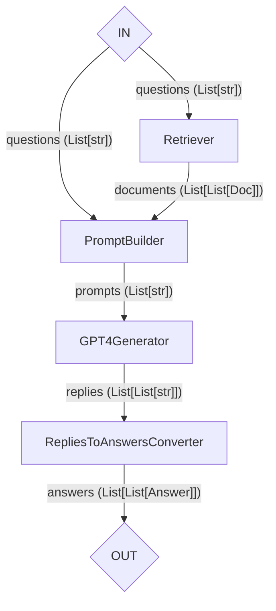

- Title: LLM SUpport in Haystack 2.0
- Decision driver: @ZanSara
- Start Date: 2023-08-10
- Proposal PR: #5540
- Github Issue or Discussion: https://github.com/deepset-ai/haystack/issues/5330

# Summary

In this proposal we outline our migration strategy of the `PromptNode` stack of functionality into Haystack 2.0 components.

This proposal, however, does not discuss Agents or Agent-related features and functionality, which are going to be addressed into a separate proposal.

# Motivation

This proposal is part of a larger effort of migrating existing Haystack 1.x components into their 2.0 counterpart.

# Basic example

In Haystack 2.0 components should be smaller than their 1.x counterpart. Therefore, we plan to split the functionality of `PromptNode` into a few smaller components.

As this proposal concerns LLM support, not specifically Agents, the main usecase in question is RAG (Retrieval-Augmented Generation).

## Example: RAG Pipeline

Using the components discussed in the Detailed Design section, a Haystack 2.0 RAG pipeline may look like this:



While the code for such pipeline may look like:

```python
from haystack.preview.components import MemoryRetriever, PromptBuilder, ChatGPTGenerator, RepliesToAnswersConverter
from haystack.preview.document_stores import MemoryDocumentStore
from haystack.preview.pipeline import Pipeline

pipe = Pipeline()
pipe.add_store("store", MemoryDocumentStore())
pipe.add_component("retriever", MemoryRetriever(), store="store")
pipe.add_component("prompt_builder", PromptBuilder("deepset/question-answering"))
pipe.add_component("llm", GPT4Generator(api_key="..."))
pipe.add_component("replies_converter", RepliesToAnswersConverter())

pipe.connect("retriever", "prompt_builder")
pipe.connect("prompt_builder", "llm")
pipe.connect("llm", "replies_converter")

questions = ["Why?", "Why not?"]
results = pipe.run({
	"retriever": {"queries": questions},
	"prompt_builder": {"questions": questions},
})

assert results == {
	"replies_converter": {
    "answers": [[Answer("Because of this.")], [Answer("Because of that.")]]
  }
}
```

# Detailed design

Haystack’s `PromptNode` is a very complex component that includes under its name several functionalities: loading prompt templates through the `PromptTemplate` class, rendering such prompt template with the variables from the invocation context, choosing which LLM backend to use, sending the prompt to the LLM using the correct invocation layer, interpreting the results, parsing them into objects, and putting them back in the pipeline in a way other components can understand.

in Haystack 2.0 we unpack these functionalities into a few separate components, to clarify what is happening, how it works, and provide additional flexibility.

The main functionalities we identified are the following:

1. Fetching the prompt from different sources
2. Rendering the prompt using variables
3. Invoke the LLM
4. Parse the output
5. History/Memory management

We leave the discussion about History/Memory to a separate proposal, as it concerns mostly Agents, and focus on the other points.

## LLM invocation

In Haystack 1.x, `PromptNode` uses `InvocationLayer` to query different LLMs under a unified API. In that design, users do not need to know which invocation layer is used for the model they select, as `PromptNode` takes responsibility of selecting it.

Such invocation layers can be ported to 2.0 as standalone components. In this way we will have one component for each LLM backed that we support.

Each component should be named after the class of models it supports, plus a `Generator` suffix. For example we should have `GPT4Generator`, `HuggingFaceLocalGenerator`, `CohereGenerator`, etc.

Note that having separate components for each LLM makes easy to deprecate them when we realize they are dropping out of favor or become severely outdated. It also makes very easy for external contributors to make their own external components to support rarer LLMs, without having to add them to Haystack’s core.

All these LLM clients will have a near-identical I/O:

```python
@component
class ChatGPTGenerator:

    @component.output_types(replies=List[List[str]])
    def run(self, prompts: List[str], ... chatgpt specific params...):
        ...
        return {'replies': [...]}
```

Note how the component takes a list of prompts and LLM parameters only, but no variables nor templates, and returns only strings. This is because input rendering and output parsing are delegated to separate components, which description follows.

Note: whether LLM components accept multiple prompts or a single one depends only on whether we want the LLM to support batching of prompts. Therefore it's an implementation decision that will be evaluated once we know the internals of the component. We strive to keep the interfaces as similar as possible to ease switching the various LLMs, but we won't force identical interfaces over them where it doesn't make sense with respect to their internal implementation.

### Chat API

Most LLMs support Chat interfaces, where they expect not a single prompt, but a list of messages in a format such as:

```
[
    {"role": "system", "content": "\nYou are a helpful assistant speaking like a pirate. argh!"},
    {"role": "user", "content": "What is the sun?"},
]
```

In this proposal we're not taking this way of querying the LLMs into account, we will just focus on simple completion. We're going to address the Chat completion topic in a dedicated proposal.

### Returning metadata

In the example above we made the LLM return only a list of replies, as strings. However, in order to be able to parse the output into meaningful objects (see “Output parsing”) we may need additional metadata from these clients.

1. Do we already have any such situation?
2. Can we foresee any other?

If the answer to any of the above is yes, a simple, maybe temporary solution would be to add a second output, called for example `'replies_meta'` . Any component that need such meta to parse the output would then request this second output along with the first and zip the two lists together to reconstruct the original output of the LLM.

### Returning streams

Most LLMs like ChatGPT have the option to stream the tokens as their generated. As we're already supporting this use case in version 1.x we want to support it in 2.x too.

Currently we're supporting it by accepting a callback during `PromptNode` initialization that will be called every time a new chunk of the streamed response is received.

In version 2.x we're going to do the same and have all generator components accept an optional callback during initialization.

### How many clients we will have?

Basing on the list of current invocation layers in Haystack 1.x, the list might look like:

1. `ClaudeGenerator`
2. `ChatGPTGenerator`, supporting GPT4 as well
    - it may have an alias `GPT4Generator` to help users
3. `CohereGenerator`
4. `HuggingFaceInferenceGenerator`
5. `HuggingFaceLocalGenerator`
6. `GPT3Generator`
7. `SagemakerGenerator`

Plus one more for any other inference hosting/library that may appear in the future.

## Prompt Builder

In Haystack 1.x, prompts fetching and rendering is carried out by `PromptTemplate`. In 2.0, we rather make a separate `PromptBuilder` component to handle this process.

The goal of `PromptBuilder` is to transform prompt templates, which are strings with variables (for example f-strings, Jinja-like templates), and fill up those variables with values that come from other components in the pipeline or from the pipeline inputs. The output of tis component is one (or more) prompts, where prompts means strings that the LLM can directly use.

`PromptBuilder` is not tokenizer aware: the prompt will be checked for length by the LLM component before inference. If the need arise, we may later extend the component.

Draft I/O for `PromptBuilder`:

```python
@component
class PromptBuilder:

    def __init__(self, template: Union[str, Path]):
        self.template = # Download the template
        template_variables = # extracts the variables from the template text
		component.set_input_parameters(**{var: Any for var in template_variables})

  	@component.output_types(prompts=List[str])
    def run(self, **kwargs):
        # Render the template using the variables
        return {"prompts": prompts}
```

### Template variables

Due to the dynamic nature of prompt templates, the `PromptBuilder.run()`  method takes `kwargs`, which contains all the variables that will be filled in the template. However, for this component to work with Canals, we need to know in advance which values this dict will contain: therefore, we need the users to specify in the `__init__` of the component the template to use.

Such template names **cannot be changed at runtime**.

The design above derives from one Canals limitation: component’s sockets need to be all known the latest at `__init__` time, in order for the connections to be made and validated. Therefore, we need to know all the prompt variables before building the pipelines, because the prompt variables are inputs of the `run()` method.

However, earlier iterations of Canals did support so-called “true variadic” components: components that do not need to know what they will be connected to, and build the input sockets at need. Such components of course lack input validation, but enable usecases like the above.

If we decide that Canals should support again such components, we would be able to rewrite `PromptBuilder` to take a prompt as its input parameter and just accept any other incoming input, on the assumption that users knows that they’re doing.

For example:

```python
@component
class PromptBuilder:

	@variadic_input
  	@component.output_types(prompts=List[str])
    def run(self, template: Union[str, Path], **kwargs):
	    # ... loads the template ...
        # ... render the prompts ...
        return {"prompts": prompts}
```

### Why a separate `PromptBuilder` component at all?

`PromptNode` used to take the prompt template and the variables to render it directly, and then forward the result to the LLM.

The key advantage of `PromptBuilder` is ability to use any tool from the ever growing list of LLM prompting template libs. If someone has invested a lot in guidance and considers using a framework like Haystack or LangChain this will be one of the biggest selling points: an ability to use `PromptBuilder` for a specific prompt tooling lib.

On top of that, it also allows users to skip the template rendering step altogether and send prompts directly to the LLM, which may be beneficial in some context (for example, if users just want to chat with the LLM without RAG).

The drawback is that `PromptBuilder` is an additional component, so we must evaluate if this additional flexibility is worth the additional complexity. However, at this point in time we are convinced that the benefits are worth the cost.

## Output parsing

LLMs clients output strings, but many components expect other object types, and LLMs may produce output in a parsable format that can be directly converted into objects. Output parsers transform these strings into objects of the user’s choosing.

In Haystack 1.x, this task was assigned to the subclasses of `BaseOutputParser`. In 2.0 we’re going to have a very similar situation, with the difference that such classes are components.

The most straightforward component in this category is `RepliesToAnswersConverter`. It takes the string replies of an LLM and produce `Answer` objects.  One additional output parser could be `RepliesToAnswersWithReferencesConverter`, which also connects answers to the documents used to produce them. As the need for additional output parsers arises, we will progressively add more.

Draft I/O for `RepliesToAnswersConverter` (note: this may end up being almost the entire component’s implementation):

```python
@component
class RepliesToAnswersConverter:

    @component.output_types(answers=List[List[Answer]])
    def run(self, replies: List[List[str]]):
        return {"answers": Answer(answer=answer) for answers in replies for answer in answers}
```

# Drawbacks

Possible drawbacks of this design:

1. Users now need to use three components instead of a single, large one.
2. We lose the capability to change the prompt for the LLM at runtime.

# Alternatives

1. Porting the existing `PromptNode` to Haystack 2.0: would be a massive effort and make the new version inherit some design decision that, with time, proved unnecessary and/or clumsy to use, like the “hiding” of invocation layer that makes it quite hard for external contributors to add support for other LLMs to `PromptNode`, or it’s imperfect layer selection algorithm.

# Adoption strategy

Follows the same strategy outlines for all other Proposal relative to the Haystack 2.0 migration

# How we teach this

We need brand new tutorials and examples of pipelines using these components.
